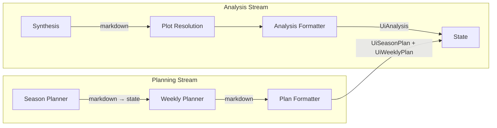

# AI → UI Contract: Markdown-First Architecture

**Status**: Implemented (schema v2 live)  
**Date**: 2026-02-14  

---

## Architecture

```
Planners/Synthesis → rich markdown → Formatter nodes → UI Blocks (HTML Blocks schema)
```

**Principle**: LLMs reason freely in markdown. Dedicated formatter nodes convert markdown to structured UI documents. The UI gets stable IDs and layout anchors; the LLM gets creative freedom.

### Data Flow



### Key design choices

| Choice | Rationale |
|---|---|
| Planners output **markdown**, not structured JSON | LLMs reason best in natural language. No schema constraints limiting output quality. |
| Season plan markdown flows to weekly planner as context | Natural data flow — no information loss from forced structuring. |
| **Formatter nodes** convert markdown → UI blocks | Narrow agent scope (Skill #3). Schema changes are isolated to formatters. |
| `UiHtmlBlock` containers (`blocks[]`, `notes_blocks[]`) | Rich HTML stays inside typed blocks with stable keys/variants for deterministic rendering. |
| Deterministic **post-fill** for metadata | `plan_id`, `athlete_name`, `created_at` are set by node code, not the LLM. |
| No prescriptive count constraints in prompts | Agents decide how many KPIs, sections, phases, weeks based on the data. |

---

## Schema

### Weekly Plan

```python
class UiHtmlBlock(BaseModel):
    type: Literal["html"] = "html"
    key: str
    variant: Literal["workout", "support", "fueling", "checklist", "callout", "notes", "meta", "generic"]
    title: str | None = None
    tone: Literal["good", "warning", "danger", "neutral"] | None = None
    content_html: str

class UiDayPlan(BaseModel):
    day_id: str
    date: datetime.date
    day_label: str | None = None
    focus_type: str | None = None
    blocks: list[UiHtmlBlock] = []

class UiWeekPlan(BaseModel):
    week_id: str
    week_label: str | None = None
    start_date: datetime.date
    end_date: datetime.date
    notes_blocks: list[UiHtmlBlock] = []
    days: list[UiDayPlan]

class UiWeeklyPlan(BaseModel):
    type: Literal["weekly_plan"] = "weekly_plan"
    plan_id: str = ""              # post-filled
    schema_version: int = 2
    version: int = 1
    athlete_name: str = ""         # post-filled
    created_at: str | None = None  # post-filled
    global_blocks: list[UiHtmlBlock] = []
    weeks: list[UiWeekPlan]
```

### Season Plan

```python
class UiSeasonPhase(BaseModel):
    phase_id: str
    title: str
    start_date: datetime.date
    end_date: datetime.date
    blocks: list[UiHtmlBlock] = []

class UiSeasonPlan(BaseModel):
    type: Literal["season_plan"] = "season_plan"
    plan_id: str = ""              # post-filled
    schema_version: int = 2
    version: int = 1
    athlete_name: str = ""         # post-filled
    start_date: datetime.date
    end_date: datetime.date
    global_blocks: list[UiHtmlBlock] = []
    phases: list[UiSeasonPhase]
```

### Analysis

```python
class UiKpi(BaseModel):
    kpi_id: str
    label: str
    value: str
    trend: str | None = None
    status: Literal["good", "warning", "danger", "neutral"] = "neutral"

class UiAnalysisSection(BaseModel):
    section_id: str
    title: str
    tone: Literal["neutral", "good", "warning", "danger"] = "neutral"
    blocks: list[UiHtmlBlock] = []

class UiAnalysis(BaseModel):
    type: Literal["analysis"] = "analysis"
    analysis_id: str = ""          # post-filled
    schema_version: int = 2
    version: int = 1
    athlete_name: str = ""         # post-filled
    created_at: str | None = None  # post-filled
    kpis: list[UiKpi]
    sections: list[UiAnalysisSection]
```

---

## Design System

Formatter prompts reference CSS classes so LLMs produce consistent, styleable HTML:

| Class | Purpose |
|---|---|
| `.kpi-table` | Metric tables with headers and zebra rows |
| `.callout-warning` / `.callout-good` / `.callout-danger` | Highlighted boxes |
| `.workout` / `.workout-title` / `.workout-meta` | Workout containers |
| `.checklist` | `<label><input type="checkbox"> Step text</label>` items |
| `.code-block` | Monospace data blocks |
| `.emoji-label` | Inline emoji + text pairs |

The UI provides a shared CSS stylesheet. The LLM writes semantic HTML; the UI controls visual appearance.

### Checkbox IDs

```html
<label>
  <input type="checkbox" id="2026-02-16--0" name="2026-02-16--0">
  Warm-up: 15' easy jog + 3 build strides
</label>
```

Sequential `--N` suffixes per day. Frontend persists state keyed to `day_id + "--" + index`.

---

## Frontend Integration (Implemented)

UI blocks are produced by formatter nodes and persisted in active plan/analysis payloads. The frontend renders `blocks[]` and `notes_blocks[]` for weekly/season/analysis views (including demo fixtures), branching on `schema_version`.

Current paths in use:

1. **API payloads**: UI schemas are serialized from DB-backed active documents.
2. **React renderers**: Structural containers (week/day/section cards) render block HTML fragments with shared styles.

---

## References

- [Decision log entry](../roadmap/decision_log.md) (2026-02-14)
- Schema source: `services/ai/langgraph/schemas/ui_blocks.py`
- Formatter nodes: `analysis_formatter_node.py`, `plan_formatter_node.py`
