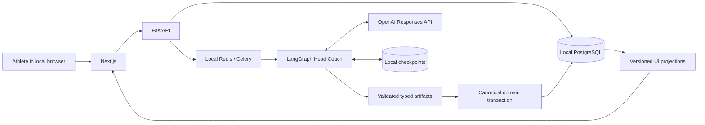

# How paced.coach works

The application turns athlete-declared context into a season roadmap and a
28-day execution block. Later coach turns read the same saved context and plans.
No wearable connector or imported activity stream is required.

## Two kinds of state

**Execution state** includes model messages, drafts, tool results and pending
clarifications. LangGraph stores it in owner-scoped PostgreSQL checkpoints. A
run can pause for an answer and continue after a process restart.

**Canonical domain state** includes active plans, decisions and job outcomes.
Application services own publication and mutation. A checkpoint is not an
activated plan. The worker commits the plans and terminal outcome together, so
a later checkpoint error cannot undo a completed domain transaction.

## Where intelligence ends and infrastructure begins

The model reasons about goals, constraints and coaching choices using the full
available context. Infrastructure validates schemas, enforces ownership and
approval, serializes conflicting writes, and handles duplicate deliveries.
It does not replace coaching judgment with a readiness score or a threshold.

Coach proposals expose a change for the athlete to accept or reject. Persistence
checks remain in application code, even when the model requests a tool call.

## Read the implementation

| Concern | Starting point |
| --- | --- |
| HTTP and local ownership | `api/routers/`, `api/deps.py` |
| Background plan publication | `worker/tasks.py` |
| Workflow and checkpoints | `services/ai/head_coach/` |
| Model roles and capabilities | `services/ai/ai_settings.py`, `services/ai/model_config.py` |
| Semantic UI contracts | `web/app/src/components/plan-viewer/versioned/` |
| Durable-boundary checks | `tests/test_head_coach_postgres_integration.py` |
| Synthetic browser checks | `web/app/e2e/` |

## Limits

The default deployment has one local owner and no login. Bind it to loopback.
The database and orchestration are local; model inference is external. Optional
LangSmith tracing can also send prompt and response content off the machine.

Synthetic acceptance runs test specific scenarios. They do not establish clinical
safety, training effectiveness, or correctness for every generated plan. See
[privacy](../local-first/privacy-and-data.md),
[coaching limitations](../local-first/ai-coaching-limitations.md) and the
[Agents API decision](agents-api-decision.md).
