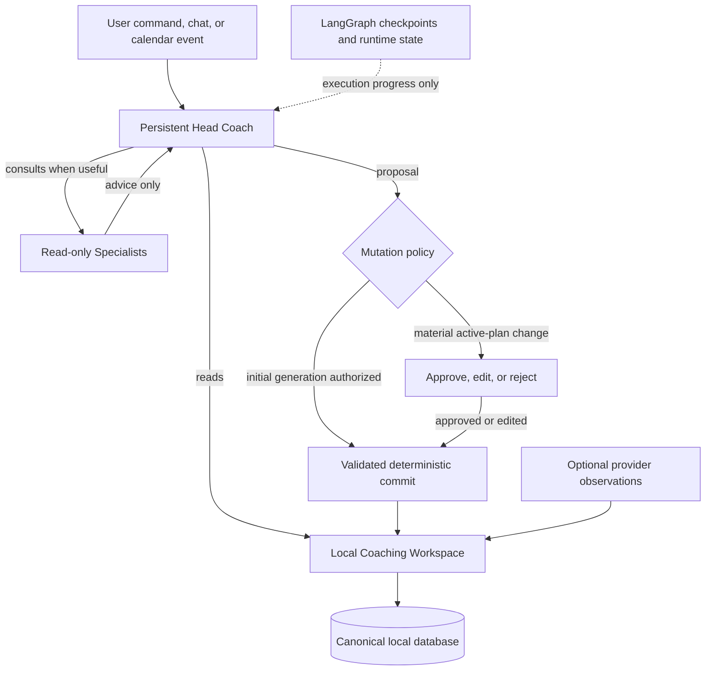

# Persistent Head Coach Agent Architecture

## Problem Frame

paced-coach is now intentionally useful without connected activity or recovery providers. The current AI workflow still reflects the earlier provider-first product: every full planning run executes provider-oriented summarizers and domain experts, then performs synthesis and several LLM formatting passes. With no provider data, these stages add latency and cost without adding corresponding coaching evidence.

The product needs one accountable coaching intelligence that works from user-declared goals, availability, constraints, calendar state, prior coaching decisions, and optional connected data. The architecture must make ownership explicit, preserve the local-first promise, recover safely from long-running failures, and improve through measurable evaluations rather than additional mandatory agents.

## Requirements

**Coaching ownership**

- R1. One logically persistent Head Coach identity and context must own the final coaching judgment across initial planning, coach chat, weekly recap, weekly adaptation, and material replanning. Persistence means durable continuity across invocations, not an always-running process.
- R2. User-declared facts must remain distinguishable from coach interpretations and optional provider observations; the coach must not present an inference as an athlete-provided fact or overwrite a user-declared fact without explicit user confirmation.
- R3. Specialists must be optional consultations selected when relevant, return advice to the Head Coach, and never directly mutate canonical athlete or plan state.
- R4. The Head Coach must ask a focused question when a material coaching decision cannot be made responsibly from available context instead of fabricating missing measurements or history.

**Local-first source of truth**

- R5. The local application database must remain canonical for the Athlete Record, Coach Model, Season Strategy, active Execution Plan, calendar operations, and Decision Ledger.
- R6. Agent execution state and derived agent memory must not become competing sources of truth for canonical coaching artifacts.
- R7. Strava, WHOOP, and future providers must remain optional read-only evidence sources. Their absence must not trigger empty provider-analysis stages or weaken the core planning and coaching capabilities.

**Agent behavior and control**

- R8. The Head Coach must receive the full available coaching context and a bounded set of atomic domain tools; deterministic code must validate and commit writes while the model owns coaching judgment.
- R9. Initial plan generation may commit its generated artifacts because the explicit generation command authorizes that action. Later material changes to an active plan must be presented as an approve, edit, or reject proposal before commit.
- R10. Model and reasoning configuration must follow the semantic responsibility of the task. Deep reasoning is reserved for consequential planning and replanning; formatting, labels, and other deterministic transformations must not consume deep-reasoning calls.
- R11. Web research and other external tools must be unavailable by default and exposed only for an explicit research need, such as event rules or course characteristics.

**Durability and product experience**

- R12. Long-running coaching work must be checkpointed durably and resumable after worker or application failure without repeating already completed expensive work.
- R13. The runtime must support durable clarification and approval pauses, idempotent resume, and protection against duplicate commits or events.
- R14. The UI must receive meaningful streaming lifecycle events such as understanding context, consulting a specialist, drafting, awaiting input, reviewing, and committing, rather than exposing framework node names as the product model.
- R15. Existing local plans, coaching history, and public API/UI contracts must remain readable during incremental migration; the architecture change must not require a destructive data rewrite.

**Output and quality**

- R16. The Head Coach must produce canonical coaching artifacts through a validated commit contract containing stable artifact identity, rich coaching content, typed calendar operations, semantic presentation intent, assumptions, risks, unresolved questions, and a Decision Ledger entry.
- R17. Rich LLM-driven UI composition must remain a core product capability. Dedicated deep-reasoning formatter agents must not be mandatory in the target path: the Head Coach should normally emit semantic component intent with its artifact, deterministic versioned React renderers own implementation and safety, and an optional low-cost UI Composer may reorganize presentation without changing coaching semantics. Invalid agent output must enter a bounded LLM repair loop with concrete validation feedback; if repair fails, the run fails visibly and no replacement content is invented or committed.
- R18. Architecture and model-policy changes must be evaluated against a provider-free baseline for coaching quality, constraint adherence, tool trajectory, latency, token use, cost, failure recovery, and unauthorized mutations.
- R19. Deep Agents must first be evaluated behind an isolated adapter or specialist spike that does not block the core Head Coach migration. It becomes a production dependency only if it measurably improves a long-horizon use case over the simpler Head Coach runtime without compromising local ownership.
- R20. Existing coaching-safety behavior for pain, injury risk, medical uncertainty, dangerous requests, and out-of-scope advice must be preserved or strengthened and covered by release-gating evaluations.

## Success Criteria

- A user can generate a useful season strategy and 28-day execution plan using only declared goals, constraints, availability, and local calendar context.
- A provider-free run performs no empty metrics, physiology, or activity specialist work.
- A failed long-running run resumes from a durable checkpoint without repeating completed model calls or committing duplicate artifacts.
- Coach chat, initial planning, and replanning present one coherent Head Coach identity and share the same canonical coaching context.
- Material changes to an active plan cannot be committed without the required user decision.
- The UI retains rich plan-specific cards, callouts, tables, checklists, timelines, and disclosures without requiring dedicated deep-reasoning formatter calls.
- A curated evaluation suite demonstrates equal or better coaching quality than the current full-run baseline while materially reducing unnecessary calls, latency, and token use.
- Optional provider evidence can improve a decision when connected, but connecting a provider is never required to access planning, recap, or coach-chat capabilities.

## Scope Boundaries

- No mandatory Strava, WHOOP, Garmin, or other provider integration is reintroduced.
- No general-purpose autonomous multi-agent organization is built; specialists exist only for bounded coaching or research consultations.
- No provider-hosted conversation state becomes the canonical application memory.
- No LangGraph or LangSmith cloud deployment is required for the local open-source release.
- No local no-login service is exposed beyond loopback as part of this work, and sensitive athlete context, credentials, or raw model reasoning may not be added to logs or public traces.
- No destructive migration or rewrite of existing local plans and coaching history is authorized by this architecture decision.
- The first delivery does not need asynchronous Deep Agents subagents, arbitrary shell access, or a general virtual filesystem.

## Key Decisions

- **One accountable Head Coach:** Many agents may advise, but one agent owns the coaching judgment and final proposal.
- **Database-owned domain truth:** PostgreSQL stores canonical coaching artifacts; runtime checkpoints store execution progress; optional agent memory stores only derived, replaceable memory.
- **Tools over mandatory stages:** The coach chooses atomic capabilities based on the actual task and available evidence instead of traversing a provider-shaped fixed pipeline.
- **Durable local runtime:** LangGraph remains the orchestration kernel for checkpoints, resume, interrupts, and streaming, while the standard agent loop moves to LangChain's current agent abstraction.
- **Explicit mutation authority:** Deterministic application code owns validation, idempotency, persistence, and authorization boundaries around agent-proposed writes.
- **Reasoning by responsibility:** Run profiles reflect the consequence and cognitive depth of a task; the system does not use maximum reasoning for every node.
- **Deep Agents by evidence:** Adopt useful patterns immediately, but gate the package itself behind a benchmarked specialist spike.
- **Safety survives simplification:** Removing mandatory agents and deep-reasoning formatter stages must not remove established coaching-safety boundaries, provenance, or rich UI composition.
- **Fail fast, let the agent repair:** Deterministic code reports contract violations precisely but does not manufacture substitute coaching or presentation content. The responsible agent gets a bounded opportunity to correct its output; exhausted repair leaves canonical state unchanged.
- **Incremental replacement:** Build a vertical Head Coach slice beside the legacy workflow, compare it against the recorded baseline, then remove old stages only after parity and compatibility are demonstrated.

## High-Level Ownership Model

## Dependencies / Assumptions

- The existing coach context, event store, plan persistence, calendar, and versioned UI contracts can be evolved incrementally rather than replaced in one release.
- Current OpenAI, LangChain, and LangGraph integrations remain available, but provider-side response state is treated as an optimization at most, never as durable ownership.
- The successful provider-free GPT run remains available as the initial quality, latency, token, and cost comparison point.

## Outstanding Questions

### Resolve Before Planning

- None.

### Deferred to Planning

- [Affects R5, R6, R12][Technical] Define the exact boundary between existing domain tables, LangGraph checkpoint persistence, and any optional long-term agent store.
- [Affects R14, R15][Technical] Map new lifecycle events and canonical artifacts onto the existing API, worker, and versioned UI contracts without breaking current clients.
- [Affects R16, R17][Technical] Define the semantic component catalog and determine when direct Head Coach presentation intent is sufficient versus an optional constrained UI Composer.
- [Affects R18, R19][Needs research] Define acceptance thresholds and representative cases for the Head Coach and Deep Agents comparison.

## Next Steps

-> `/ce:plan` for structured implementation planning.
