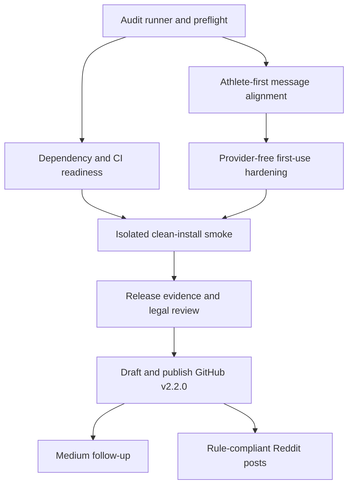

# feat: Ship the athlete-first OSS release

## Superseding Provider-Free Decision — 2026-07-13

The maintainer selected a provider-free v2.2.0 after reviewing the current provider API terms. Strava, WHOOP, OAuth, imports, daily sync, and weekly recap are removed from the public runtime and launch claims. Legacy credential/schema rows remain only for non-destructive compatibility and are never read or transmitted by the release runtime. A future connector requires written provider permission or a clearly compatible contract plus a new legal/security review.

This decision supersedes later references in this plan to optional connectors or connected regressions. Units 1–5 remain valid as historical execution evidence; Unit 6 closes against the provider-free product contract.

## Overview

Prepare and publish the first polished GitHub release of paced.coach as a powerful AI endurance coach for technically confident, self-coached athletes. The product must lead with the outcome — season roadmap, living 28-day plan, and continuing coach conversation — and repeat the boundary **no wearable required**. Version 2.2.0 is provider-free.

The underlying no-provider product path already exists. This plan concentrates on proving it from a clean environment, aligning every public message, making the release audit repeatable, recording non-sensitive evidence, satisfying the legal gate, and only then publishing and promoting the release (see origin: `docs/brainstorms/2026-07-13-athlete-first-oss-release-requirements.md`).

## Problem Frame

The repository currently describes a local-first application well, but some high-visibility copy still says “connected endurance coaching,” and the generation UI calls provider-free planning “Draft Mode.” Those phrases weaken the actual value proposition and can make Strava/WHOOP sound foundational. At the same time, the repository has a long pre-OSS Git history, no published tags, no durable release-audit runner, and no recorded clean-install acceptance result. A public campaign before closing those gaps would amplify an artifact whose strongest promise has not yet been demonstrated end to end.

The initial audience accepts Docker, Node.js, Pixi, and an LLM API key. The release does not attempt to solve consumer-grade installation, public hosting, multi-user auth, or new integrations.

## Requirements Trace

- **R1–R4 — Product promise:** Athlete value leads; “no wearable required” is explicit; declared athlete context is accurately described; local-first architecture supports rather than replaces the headline.
- **R5–R8 — First-use experience:** A fresh user reaches a season roadmap and 28-day plan without providers, can continue into coach chat, sees connectors as secondary, and can inspect only synthetic public demo data.
- **R9–R12 — Release quality:** Setup and failure guidance are reproducible; code, history, secrets, private data, and artifacts are audited; legal review gates publication; known AI, medical, hosting, and loopback boundaries remain explicit.
- **R13–R16 — Launch:** The story connects the Garmin experiment to a platform-independent coach; a tested GitHub release precedes promotion; Medium and Reddit lead with athlete value and show the complete app experience.

## Scope Boundaries

- Do not expose the no-login app beyond loopback or add a hosted deployment path.
- Do not alter, migrate, reset, or inspect the maintainer's existing athlete database during release validation.
- Do not add hosted auth, payments, multi-user support, German localization, or new data connectors.
- Do not make daily sync or weekly recap provider-free; they remain optional connected-data features.
- Do not resolve unrelated LangGraph technical debt or redesign the application.
- Do not claim medical, diagnostic, autonomous, or device-derived knowledge the coach does not have.
- Do not publish the release tag or begin broad promotion before the external legal review is complete.
- Do not commit generated launch drafts, audit reports, local screenshots, or personal smoke-test data unless they have passed the public-artifact review.

## Context & Research

### Relevant Code and Patterns

- `README.md` already documents the provider-free path as profile → competition/goal → plan → coach and clearly states the localhost safety boundary.
- `api/services/dashboard_state.py::_build_first_run_state` implements the first-run sequence and distinguishes declared-only evidence from connected evidence.
- `api/services/evidence_profile.py` and prompt-contract tests prevent unsupported activity, load, sleep, HRV, recovery, and readiness claims when no provider is connected.
- `api/services/coach_turn.py` allows coach chat without a training provider; provider gates remain limited to daily sync and weekly recap.
- `web/app/src/app/app/new/page.tsx` already loads profile, competitions, provider status, and LLM readiness, but its “Draft Mode” language makes the baseline path sound provisional.
- `web/app/src/app/demo/page.tsx` and `web/app/src/lib/demo/fixtures/v1/` provide the synthetic public preview and screenshot source.
- `docker-compose.yml` binds Postgres, Redis, and the API to `127.0.0.1`; `api/config.py` rejects unsafe local-auth contexts by default.
- `.github/workflows/ci.yml`, `Makefile`, and version-governance scripts provide the existing automated quality gate.
- `.gitleaks.toml` exists, but no repeatable release-audit runner or committed verification record exists.
- `config/version_manifest.yaml`, `pyproject.toml`, `pixi.toml`, and `web/app/package.json` already agree on release `2.2.0`; no Git tags or GitHub releases currently exist.
- No relevant institutional learnings exist under `docs/solutions/`.

### External References

- GitHub recommends drafting a release before publishing it; immutable releases lock tags and assets and generate release attestations: https://docs.github.com/en/repositories/releasing-projects-on-github/managing-releases-in-a-repository and https://docs.github.com/en/code-security/concepts/supply-chain-security/immutable-releases
- Current Gitleaks uses `git` and `dir` scan modes; `detect` and `protect` are deprecated. Redacted reporting prevents secret material from leaking into evidence: https://github.com/gitleaks/gitleaks
- Reddit's current spam policy prohibits repeated mass promotion and expects authentic participation plus community-rule checks: https://support.reddithelp.com/hc/en-us/articles/360043504051-Spam
- As researched on 2026-07-13, `r/running` prohibits self-promotion; `r/selfhosted` routes projects younger than three months to its current New Project Megathread; `r/opensource` permits limited promotion with the correct flair but prohibits AI-generated low-effort content. Rules must be checked again immediately before posting.

## Key Technical Decisions

| Decision | Rationale |
|---|---|
| Keep `2.2.0` for the first GitHub tag | All canonical manifests already carry `2.2.0`, there are no prior tags/releases, and the product is explicitly an evolution of the earlier coach rather than a semantic reset. |
| Treat Ubuntu/Linux as the verified first-release environment | CI and the existing shell/Docker workflow are Linux-grounded. macOS and Windows remain best-effort/unverified until exercised; this avoids an unsupported portability claim. |
| Validate with disposable infrastructure | A unique Compose project/volume namespace and synthetic athlete profile prevent the smoke test from reading or mutating the maintainer's local plans. |
| Keep the real-LLM smoke test manual and evidence-based | The acceptance criterion is product quality and cross-service behavior, not deterministic model prose. Automated tests continue to validate contracts; the release checklist records human review of the actual result. |
| Add a repeatable non-destructive audit runner | A scripted gate reduces omission risk and can cover both the working tree and all reachable Git history while redacting findings. |
| Stop rather than auto-remediate audit findings | Secret rotation, history rewriting, or deletion of local artifacts are destructive/high-impact decisions and require explicit maintainer approval. |
| Keep launch copy outside tracked source until publication | The repository deliberately removed internal marketing artifacts. Medium/Reddit drafts should be prepared in an ignored local workspace or the destination editor, then published by the maintainer after review. |
| Ship v2.2.0 provider-free | The declared-context product passed real-model acceptance on its own, while reviewed provider terms do not support the intended default AI-processing and launch posture. |

## Open Questions

### Resolved During Planning

- **Minimum provider-free context:** Current readiness considers one physiology anchor, selected sport, days per week, time windows, and a primary goal; a competition can substitute for the goal anchor. The release smoke persona should populate all five areas plus one A-race to test the richest intended path without providers.
- **Clean-install matrix:** Ubuntu/Linux with Docker Compose v2, Node.js 24, Pixi, and one supported LLM key is the required release matrix. Other operating systems are documented as unverified rather than silently promised.
- **Release version:** Publish the first tag as `v2.2.0` if no feature or schema change forces a version bump during execution.
- **Reddit targets:** Exclude `r/running`; use only the current permitted surface for `r/selfhosted`; treat `r/opensource` as optional and require a genuinely maintainer-authored post; evaluate `r/SideProject` immediately before promotion.

### Deferred to Implementation

- **Audit findings:** The presence and severity of historical secrets or private artifacts can only be known by running the pinned audit. Any finding pauses the plan for rotation and remediation decisions.
- **Real model quality:** The provider-free plan and follow-up coach response must be judged during the isolated smoke test against the origin success criteria.
- **Legal corrections:** Counsel may require changes to public legal pages or distribution wording; those changes are applied and reverified before publication.
- **Final launch timing:** Choose dates only after the release candidate, legal gate, and GitHub draft release are ready.

## Release Flow

> This illustrates the intended approach and is directional guidance for review, not implementation specification. The implementing agent should treat it as context, not code to reproduce.

Prose and unit dependencies below are authoritative if this diagram becomes stale.

## Implementation Units

- [x] **Unit 1: Add the non-destructive public-release audit gate**

**Goal:** Make tracked-file, full-history secret, generated-artifact, workflow, and hosted-ops checks repeatable without exposing findings or touching local athlete data.

**Requirements:** R10, R12

**Dependencies:** None

**Files:**
- Create: `scripts/release_audit.sh`
- Create: `tests/test_release_audit_contract.py`
- Create: `docs/local-first/release-checklist.md`
- Modify: `.gitignore`
- Modify: `SECURITY.md`

**Approach:**
- Use the pinned Gitleaks `v8.30.1` container and its supported `git` and `dir` modes with full redaction; keep reports under an ignored `.tmp/release-audit/` directory. The history scan must cover all reachable refs. The directory scan must run against an isolated export of tracked/release files rather than the live working directory so ignored `.env`, databases, caches, and athlete artifacts are never opened by the scanner.
- Supplement secret scanning with deterministic checks for tracked env files, database/export/cache paths, oversized/generated artifacts, workflow secret references, public-network bindings, and stale hosted auth/payment/deployment surfaces.
- Inventory ignored secret/data path names and release-risk categories without reading their contents; their mere local presence is expected and is not a failure unless they are tracked or included in a release artifact.
- Emit a concise pass/fail summary and filenames/rule identifiers only. Never echo candidate secret values or personal data.
- Default to read-only checks. Do not rotate keys, rewrite history, delete files, prune Docker state, or modify Git state.
- Document the halt path: rotate any exposed key first, then ask for explicit approval before history rewriting or destructive remediation.

**Patterns to follow:**
- `.gitleaks.toml` for project allowlists and test-key exclusions.
- `scripts/check_version_governance.py` for clear `[OK]`/`[ERROR]` output and nonzero failure status.
- `SECURITY.md` for the existing public-release gate categories.

**Test scenarios:**
- **Happy path:** A synthetic clean fixture repository containing only allowed example credentials passes and prints no secret-like values.
- **Error path:** A committed synthetic secret causes a nonzero result while output and stored reports redact the matched value.
- **Edge case:** An ignored local `.env` is reported by filename/category only, is never copied into the tracked-file scan export, and does not become tracked.
- **Integration:** A synthetic secret reachable only from a non-current Git ref is still found and redacted by the full-history scan.
- **Error path:** A tracked file under a forbidden private-data/generated-artifact path fails with the path and category only.
- **Safety:** Running the audit leaves tracked files, refs, Docker volumes, and local data directories unchanged.

**Verification:**
- One documented audit entry point covers all categories listed in `SECURITY.md`, fails closed, produces only redacted ignored artifacts, and is safe to rerun.

- [x] **Unit 2: Close dependency, CI, and version readiness**

**Goal:** Start the release candidate from reviewed dependencies and a coherent `2.2.0` manifest before product-facing polish.

**Requirements:** R9, R10, R14

**Dependencies:** Unit 1 audit must pass or have approved remediation before a release candidate proceeds.

**Files:**
- Modify as required: `web/app/package.json`
- Modify as required: `web/app/package-lock.json`
- Verify: `.github/workflows/ci.yml`
- Verify: `config/version_manifest.yaml`
- Verify: `pyproject.toml`
- Verify: `pixi.toml`
- Verify: `web/app/src/lib/generated/version-manifest.ts`
- Modify: `CHANGELOG.md`

**Approach:**
- Review and land the two open Dependabot updates independently; do not batch unrelated dependency churn.
- Preserve release version `2.2.0` unless implementation introduces product/schema behavior that warrants a new version; if it changes, update every governed manifest through the existing generator.
- Convert the Unreleased changelog into a user-facing `2.2.0` entry centered on provider-free coaching, local ownership, and optional connectors.
- Keep CI permissions read-only and retain all current backend, frontend, build, and governance gates.

**Patterns to follow:**
- `agents_docs/ops/version_governance.md` and existing version-governance scripts.
- Focused Dependabot PRs #3 and #4 rather than manual broad upgrades.

**Test scenarios:**
- **Happy path:** Updated lockfile installs reproducibly and all frontend checks/build pass.
- **Integration:** Release version remains identical across the canonical manifest, Python package, Pixi project, web package, and generated web artifact.
- **Regression:** Backend lint, type-check, tests, frontend lint/type-check/tests/build, and both version-governance checks remain green after dependency updates.
- **Error path:** Version drift or a missing renderer/fixture fails the existing governance gate before release.

**Verification:**
- Dependabot PRs are resolved, main CI is green at the release-candidate commit, and `2.2.0` is consistent everywhere.

- [x] **Unit 3: Align all public messaging around athlete value**

**Goal:** Make “powerful coach, no wearable required” the consistent message across GitHub, metadata, social previews, demo, and roadmap sources of truth.

**Requirements:** R1–R4, R7, R8, R13, R15, R16

**Dependencies:** Unit 1 provides the artifact-safety gate; this unit can otherwise proceed in parallel with Unit 2.

**Files:**
- Modify: `README.md`
- Modify: `web/app/src/app/layout.tsx`
- Modify: `web/app/src/app/page.tsx`
- Modify: `web/app/src/app/demo/page.tsx`
- Modify: `web/app/public/og.svg`
- Modify after reviewed recapture: `docs/assets/readme/paced-coach-hero.png`
- Modify after reviewed recapture: `docs/assets/readme/paced-coach-dashboard.png`
- Modify after reviewed recapture: `docs/assets/readme/paced-coach-plan.png`
- Modify after reviewed recapture: `docs/assets/readme/paced-coach-coach.png`
- Modify: `docs/local-first/setup.md`
- Modify: `docs/local-first/ai-coaching-limitations.md`
- Modify: `agents_docs/roadmap/now.md`
- Modify: `agents_docs/roadmap/decision_log.md`
- Test: `web/app/src/tests/fixtures/validate-fixtures.ts`
- Create: `web/app/src/tests/public/messaging-contract.ts`
- Modify: `web/app/package.json`

**Approach:**
- Lead with the concrete sequence: describe athlete context, generate a season roadmap and 28-day plan, keep talking to the coach.
- Repeat “no wearable required” near the first product promise and explain immediately that an LLM key and athlete-provided context are still required.
- Replace “connected endurance coaching” and “paywalled dashboard” as primary framing; local-first and full-stack architecture become proof points beneath the athlete outcome.
- Present Strava and WHOOP as opt-in additions for activity/recovery context, daily sync, and weekly recap — never as login or prerequisites.
- Keep screenshots and demo fixtures synthetic; update only the intentionally generated README assets after inspecting every frame for private data.
- Record athlete-first/no-wearable positioning as a durable decision and make the release the active roadmap focus.

**Patterns to follow:**
- `README.md#First Useful Run` for the correct provider-free journey.
- `web/app/public/og.svg` for the existing season-roadmap/28-day-plan message hierarchy.
- `docs/local-first/ai-coaching-limitations.md` for accurate evidence boundaries.

**Test scenarios:**
- **Content contract:** A dedicated messaging test verifies that README, root metadata, demo metadata, OpenGraph asset, and demo hero all state or directly support “no wearable required.”
- **Accuracy:** Every no-wearable claim also identifies declared athlete context and the LLM provider as necessary inputs.
- **Boundary:** Strava/WHOOP appear only as optional enhancements and no public copy promises daily sync/weekly recap without connected evidence.
- **Artifact safety:** Fixture validation passes and regenerated screenshots contain only the named synthetic persona and no email, UUID, trace ID, key, or private activity data.
- **Responsive/accessibility:** Revised hero and metadata-linked preview remain readable on mobile/desktop and the SVG retains meaningful accessible alt usage through metadata.

**Verification:**
- A copy inventory finds no high-visibility “connected coach” or “Draft Mode” positioning, and a reader can summarize the product without naming Garmin, Strava, or WHOOP.

- [x] **Unit 4: Harden the provider-free first-use and coach handoff**

**Goal:** Ensure the in-app flow treats declared athlete context as a complete baseline path and handles missing prerequisites or downstream failures honestly.

**Requirements:** R3, R5–R7, R9, R12

**Dependencies:** Unit 3 establishes the approved vocabulary.

**Files:**
- Modify: `web/app/src/app/app/new/page.tsx`
- Modify as required: `web/app/src/components/dashboard/dashboard-client.tsx`
- Modify: `api/services/dashboard_state.py`
- Test: `tests/test_dashboard_state.py`
- Test: `tests/test_api_coach_turn_routes.py`
- Test: `tests/test_training_plan_prompt_contracts.py`
- Create or modify: `web/app/src/tests/onboarding/no-provider-first-run.ts`
- Modify: `web/app/package.json`

**Approach:**
- Remove user-facing “Draft Mode” language. Say directly that planning uses saved profile, goals/races, availability, constraints, and generation notes now; connected sources add later evidence.
- Preserve the current backend state keys and provider-neutral evidence policy to avoid unnecessary API/schema churn.
- Keep plan generation available with sparse context but make the richer recommended profile fields explicit; do not add new deterministic coaching heuristics or provider gates.
- Maintain the ordered setup recovery states: missing LLM key → incomplete profile → missing goal/race → generate → open plan → ask coach.
- Confirm that plan-generation failures retain the user's saved profile/race context and provide an actionable retry path.
- Characterize coach chat without providers so a later refactor cannot silently reintroduce a connector requirement.

**Patterns to follow:**
- `_build_first_run_state` and `profileCompleteness` for existing readiness guidance.
- `api/services/evidence_profile.py` for claim boundaries.
- `_ensure_connected_coach_chat_available` behavior and `require_training_provider=False` in the coach tool registry for provider-free chat.

**Execution note:** Add characterization coverage before changing user-facing first-run behavior.

**Test scenarios:**
- **Happy path:** With one LLM key, complete declared profile, primary goal/A-race, and no providers, first-run state points to plan generation and the generation screen is enabled.
- **Happy path:** After an active plan exists with no providers, first-run state points to the plan and exposes “Ask coach”; a mocked coach turn succeeds with declared-only evidence.
- **Error path:** With no LLM key, generation is blocked with the exact local configuration recovery step and no connector CTA.
- **Edge case:** With a primary goal but no competition, the user can proceed and sees reduced-specificity guidance rather than a provider requirement.
- **Edge case:** With a competition but no primary-goal text, the race anchors readiness and generation remains available.
- **Error path:** Context-fetch or generation failure shows a retryable error without discarding saved profile/competition data.
- **Boundary:** No-provider prompts forbid claims about recent activity, load, compliance, sleep, HRV, recovery, or readiness while allowing declared profile/goal claims.
- **Connected regression:** Existing Strava/WHOOP status, daily-sync, and recap gates continue to behave as optional connected features.

**Verification:**
- The complete no-provider path is covered across backend state, frontend readiness, prompt boundaries, plan generation handoff, and coach chat without changing public schemas.

- [x] **Unit 5: Execute and record an isolated clean-install release-candidate smoke**

**Goal:** Prove the actual multi-service product path with a real supported LLM from a clean Linux environment while protecting all existing local data.

**Requirements:** R5, R6, R8–R10, R14, R16 and all success criteria

**Dependencies:** Units 1–4 complete; release-candidate CI green.

**Files:**
- Modify: `docs/local-first/release-checklist.md`
- Create: `docs/releases/v2.2.0-verification.md`
- Modify as findings require: `README.md`
- Modify as findings require: `docs/local-first/setup.md`

**Approach:**
- Clone the release candidate into a separate path on a clean Ubuntu/Linux environment and use a unique Compose project with disposable volumes; never point at existing volumes, `LOCAL_OWNER_USER_ID`, exports, or databases.
- Configure only the minimum local values and one real LLM key. Leave Fernet, Strava, WHOOP, and LangSmith unset.
- Follow the public docs exactly. Populate a synthetic but realistic athlete across all five readiness dimensions plus one A-race, generate a plan, inspect season and 28-day outputs, then ask the coach a plan-specific follow-up.
- Confirm that the app never asks for a connector, invents device-derived evidence, or exposes a service beyond loopback.
- Record versions, environment, commit SHA, elapsed setup outcome, page/flow outcomes, and redacted pass/fail notes. Do not commit prompts, model traces, keys, raw logs, database contents, or screenshots from this smoke run.
- Remove only the disposable smoke namespace after evidence is recorded; stop and ask before any command could affect non-disposable volumes.
- Capture a pre-run inventory of Compose project/volume names and compare it after cleanup. Any unexpected change outside the disposable namespace is a No-Go and must be investigated before continuing.

**Patterns to follow:**
- `README.md#Quick Start` and `#First Useful Run` as the test script from the user's perspective.
- `tests/test_api_smoke_no_ai.py` for expected job lifecycle and immutable context snapshot behavior.
- `docs/local-first/data-preservation.md` for non-destructive ownership and backup boundaries.

**Test scenarios:**
- **Clean setup:** Fresh clone plus documented prerequisites reaches healthy web/API/worker/database/Redis services without undocumented steps.
- **Provider-free E2E:** Synthetic profile and race generate a season roadmap and 28-day calendar with Strava/WHOOP disabled.
- **Coach continuation:** A question referencing a specific generated session receives a context-aware answer without provider claims.
- **Error recovery:** Temporarily missing LLM configuration produces actionable guidance; restoring it and restarting allows generation.
- **Network boundary:** Host-visible service bindings remain loopback-only.
- **Data isolation:** Existing local Compose projects, volumes, databases, env files, and athlete artifacts are unchanged before and after the run.
- **Restart durability:** A normal stop/start of the disposable stack preserves the synthetic profile and generated plan.

**Verification:**
- `docs/releases/v2.2.0-verification.md` records a passing clean-install outcome for every origin success criterion with no sensitive evidence committed.

- [ ] **Unit 6: Close legal, documentation, and release-candidate gates**

**Goal:** Produce a release candidate that is technically complete, factually documented, externally reviewed, and ready to tag without unresolved blockers hidden in prose.

**Requirements:** R9–R14

**Dependencies:** Units 1–5; external Germany-based legal review.

**Files:**
- Modify: `LEGAL_TODO.md`
- Modify as counsel requires: `web/app/src/app/impressum/page.tsx`
- Modify as counsel requires: `web/app/src/app/privacy/page.tsx`
- Modify as counsel requires: `web/app/src/app/terms/page.tsx`
- Modify as counsel requires: `web/app/src/app/support/page.tsx`
- Modify as counsel requires: `web/app/src/app/delete/page.tsx`
- Modify: `CHANGELOG.md`
- Create: `docs/releases/v2.2.0.md`
- Modify: `docs/releases/v2.2.0-verification.md`

**Approach:**
- Give counsel the actual local-first data flow, external processors, no-login/loopback boundary, deletion behavior, and planned distribution context; treat returned wording as an operational draft, not AI-generated legal advice.
- Resolve or explicitly retain every `LEGAL_TODO.md` item. No unchecked item may be silently described as complete in release notes.
- Write concise GitHub release notes: athlete outcome, provider-free no-wearable first-use path, setup, privacy/network boundary, known limitations, and verification evidence.
- Keep counsel correspondence and any personal/legal supporting documents outside the repository. Commit only approved public wording and a factual review status.
- Rerun the audit and full verification after all legal/copy changes and record final commit-specific results.
- Use an explicit Go/No-Go checklist: audited commit fixed, CI green, clean-install evidence green, legal gate complete, no unresolved blocker, draft release inspected, and maintainer approval recorded. Any failed item returns the candidate to the relevant earlier unit.

**Patterns to follow:**
- Root legal-content guardrails and `LEGAL_TODO.md` for factual placeholders and review tracking.
- `CHANGELOG.md` for user-visible changes; `docs/releases/v2.2.0-verification.md` for non-sensitive evidence rather than raw logs.

**Test scenarios:**
- **Consistency:** Business identity, contact, address, processor, retention, deletion, and support facts agree across all five legal pages and release documentation.
- **Boundary:** Every page and release note consistently describes local-first storage, configured LLM processing, no external training-data connectors, optional LangSmith, and localhost-only no-login use.
- **Deletion flow:** Counsel-facing wording matches a disposable-data reset observation and does not promise deletion from third-party processors the app cannot perform.
- **Regression:** Frontend lint/type-check/tests/build and full backend checks pass after legal copy changes.
- **Gate:** Release remains blocked while external review or any must-fix legal item is incomplete.

**Verification:**
- Legal review is recorded, required corrections are applied, `LEGAL_TODO.md` reflects reality, final audit/CI evidence is green, and `docs/releases/v2.2.0.md` is ready to become the GitHub draft release body.

- [ ] **Unit 7: Publish `v2.2.0`, then launch the evolution story**

**Goal:** Publish an integrity-protected GitHub release and follow it with authentic, channel-specific Medium and Reddit communication.

**Requirements:** R13–R16

**Dependencies:** Unit 6 complete and explicit maintainer confirmation immediately before external publication.

**Files:**
- Verify: `docs/releases/v2.2.0.md`
- Modify after publication: `README.md` only if a stable release link or badge materially improves setup discovery
- Local ignored working material only: `.tmp/launch/`

**Approach:**
- Enable GitHub release immutability if available, create the `v2.2.0` release as a draft against the verified commit, inspect all notes/assets, then ask for the final maintainer go-ahead before publishing.
- Attach no personal/generated assets; rely on reviewed repository screenshots and source archives unless a separately audited artifact is necessary.
- Verify the published tag/commit and immutable release state before sharing links.
- Draft the Medium article in the maintainer's voice around: Garmin experiment → realization that coaching cannot depend on one platform → declared-context coaching → season/28-day/coach experience → local-first architecture → provider-free boundary → honest limitations → how to run it.
- Prepare separate Reddit posts rather than mass-cross-posting identical copy. Lead with what was learned and invite critique; disclose authorship/affiliation and remain available for discussion.
- Recheck rules on posting day. Exclude `r/running`; use `r/selfhosted` only in its permitted current project surface; skip `r/opensource` unless the maintainer has rewritten and personally owns the post under its anti-AI-content rule; evaluate other communities individually.
- Publish Medium first after the release is stable, then Reddit over a measured cadence rather than simultaneous repeated promotion.
- Treat publication as irreversible. If a post-publication defect appears, annotate/deprecate the affected release as appropriate and publish a corrected patch release from a newly audited commit; never move or reuse the immutable `v2.2.0` tag.

**Patterns to follow:**
- GitHub's draft-first immutable-release workflow.
- Reddit's sitewide authentic-participation guidance plus current per-community rules.
- The origin decision that athlete value leads and end-to-end architecture is supporting proof.

**Test scenarios:**
- **Release integrity:** `v2.2.0` resolves to the exact audited commit and the release is reported immutable/verified when the GitHub feature is available.
- **Post-publication recovery:** A tabletop defect scenario results in a documented patch-release path without editing assets, moving the tag, or obscuring the affected version.
- **Link validation:** Release notes, README setup links, demo references, screenshots, legal/support links, and article links resolve without private or local-only URLs.
- **Message consistency:** GitHub, Medium, and each Reddit post lead with provider-free athlete value and make clear that v2.2.0 has no external training-data connector.
- **Policy compliance:** Each Reddit target is checked on posting day; prohibited communities are skipped and posts use the required flair/thread format.
- **Authenticity:** The maintainer reviews and rewrites promotional copy in their own voice before publication; generated drafts are not posted verbatim where prohibited.

**Verification:**
- The release is public and verifiably tied to the audited commit; the Medium article is live; every Reddit submission is compliant, distinct, disclosed, and linked to the stable release.

## System-Wide Impact

- **Interaction graph:** Public discovery (`README`, metadata, social preview, demo) leads into local setup, first-run readiness, profile/race context, asynchronous planning, plan rendering, and provider-free coach chat. Optional providers branch only into richer evidence, daily sync, and weekly recap.
- **Error propagation:** Setup and generation failures must surface actionable local recovery without redirecting users to connectors. Audit, CI, legal, or smoke failures halt publication rather than becoming warnings.
- **State lifecycle risks:** Clean-install validation uses isolated disposable state. Normal restart must preserve it; cleanup must target only the disposable namespace. No release task may rewrite real owner IDs or plans.
- **API surface parity:** No public API or schema change is intended. Existing declared-only/connected evidence fields and versioned renderers remain stable.
- **Integration coverage:** Automated contracts prove readiness and claim boundaries; the clean-install smoke proves the real web/API/worker/Postgres/Redis/LLM path that mocks cannot.
- **Unchanged invariants:** Local owner mode, loopback binding, provider read-only scopes, schema-version routing, data-preservation rules, and agent-led coaching judgment remain unchanged.

## Risks & Dependencies

| Risk | Likelihood | Impact | Mitigation |
|---|---:|---:|---|
| Full Git history contains a real secret or private artifact | Medium | Critical | Run the redacted history audit first; rotate immediately; pause for approved remediation/history strategy. |
| “No wearable required” is read as “no data/context required” | Medium | High | Pair the phrase with declared profile, goals, races, availability, constraints, and one LLM key everywhere. |
| Provider-free plan quality is weak despite passing contracts | Medium | High | Require a real-LLM synthetic smoke and human acceptance before tagging. |
| Clean smoke touches existing athlete data | Low | Critical | Separate clone, unique Compose namespace, disposable volumes, no existing owner ID, pre/post isolation evidence. |
| External legal review delays publication | Medium | High | Start counsel review while technical polish runs; keep tag and promotion gated rather than weakening the requirement. |
| Linux-only verification surprises macOS/Windows users | Medium | Medium | State the supported/tested matrix explicitly and label other platforms unverified.
| Reddit promotion is removed or perceived as spam | Medium | Medium | Recheck rules, avoid `r/running`, use designated threads/flairs, disclose affiliation, customize posts, and engage authentically. |
| Immutable release is published with a bad asset or note | Low | High | Create and inspect a draft first; use only reviewed assets; require final maintainer confirmation. |
| A defect is discovered after immutable publication | Low | High | Preserve the tag, disclose the issue, prepare a newly audited patch release, and delay promotion until the corrected version is stable. |
| Dependency updates introduce unrelated churn | Low | Medium | Keep Dependabot updates isolated and require full CI per update. |

## Phased Delivery

### Phase 1 — Release candidate safety

- Unit 1: audit gate
- Unit 2: dependency/CI/version readiness
- Begin external legal review with current facts

### Phase 2 — Product truth and first-use proof

- Unit 3: public message alignment
- Unit 4: provider-free first-use hardening
- Unit 5: isolated clean-install and real-LLM acceptance

### Phase 3 — Publication gates

- Unit 6: legal corrections, release notes, final audit and verification
- Maintainer go/no-go checkpoint
- Unit 7: immutable GitHub release

### Phase 4 — Story distribution

- Medium follow-up article
- Rule-compliant, paced Reddit submissions
- Capture real feedback as future roadmap input rather than expanding this release in flight

## Success Metrics

- A clean Ubuntu/Linux environment reaches a season roadmap, 28-day plan, and plan-aware coach response with no provider configured.
- Every public surface consistently leads with athlete value and “no wearable required.”
- Full audit, CI, clean-smoke, and legal gates have commit-specific passing evidence.
- `v2.2.0` is tied to the audited commit and published through a draft-first integrity workflow.
- Launch posts comply with current community rules and generate discussion without mass-posting identical promotional copy.

## Documentation / Operational Notes

- `agents_docs/roadmap/now.md` changes from cleanup to release completion; `agents_docs/roadmap/decision_log.md` records athlete-first/no-wearable positioning.
- `docs/local-first/release-checklist.md` becomes the reusable operational gate; `docs/releases/v2.2.0-verification.md` is release-specific evidence.
- Verification records contain command/result summaries, versions, commit IDs, and synthetic scenario outcomes — never secrets, raw model context, private data, or unreviewed screenshots.
- Publishing GitHub, Medium, or Reddit is an external mutation. Execution pauses for the maintainer immediately before each public action unless the maintainer explicitly performs it.
- Go/No-Go evidence is binary and commit-specific. A later code, dependency, legal-copy, fixture, or release-note change invalidates the relevant audit/build/smoke evidence and requires that gate to be rerun.

## Sources & References

- **Origin document:** [docs/brainstorms/2026-07-13-athlete-first-oss-release-requirements.md](../brainstorms/2026-07-13-athlete-first-oss-release-requirements.md)
- Product/setup: `README.md`, `docs/local-first/setup.md`, `docs/local-first/ai-coaching-limitations.md`
- First-run flow: `api/services/dashboard_state.py`, `web/app/src/app/app/new/page.tsx`
- Evidence boundaries: `api/services/evidence_profile.py`, `tests/test_training_plan_prompt_contracts.py`
- Release/security policy: `SECURITY.md`, `.gitleaks.toml`, `.github/workflows/ci.yml`
- Versioning: `agents_docs/ops/version_governance.md`, `config/version_manifest.yaml`
- GitHub release management: https://docs.github.com/en/repositories/releasing-projects-on-github/managing-releases-in-a-repository
- GitHub immutable releases: https://docs.github.com/en/code-security/concepts/supply-chain-security/immutable-releases
- Gitleaks: https://github.com/gitleaks/gitleaks
- Gitleaks `v8.30.1`: https://github.com/gitleaks/gitleaks/releases/tag/v8.30.1
- Reddit spam policy: https://support.reddithelp.com/hc/en-us/articles/360043504051-Spam
