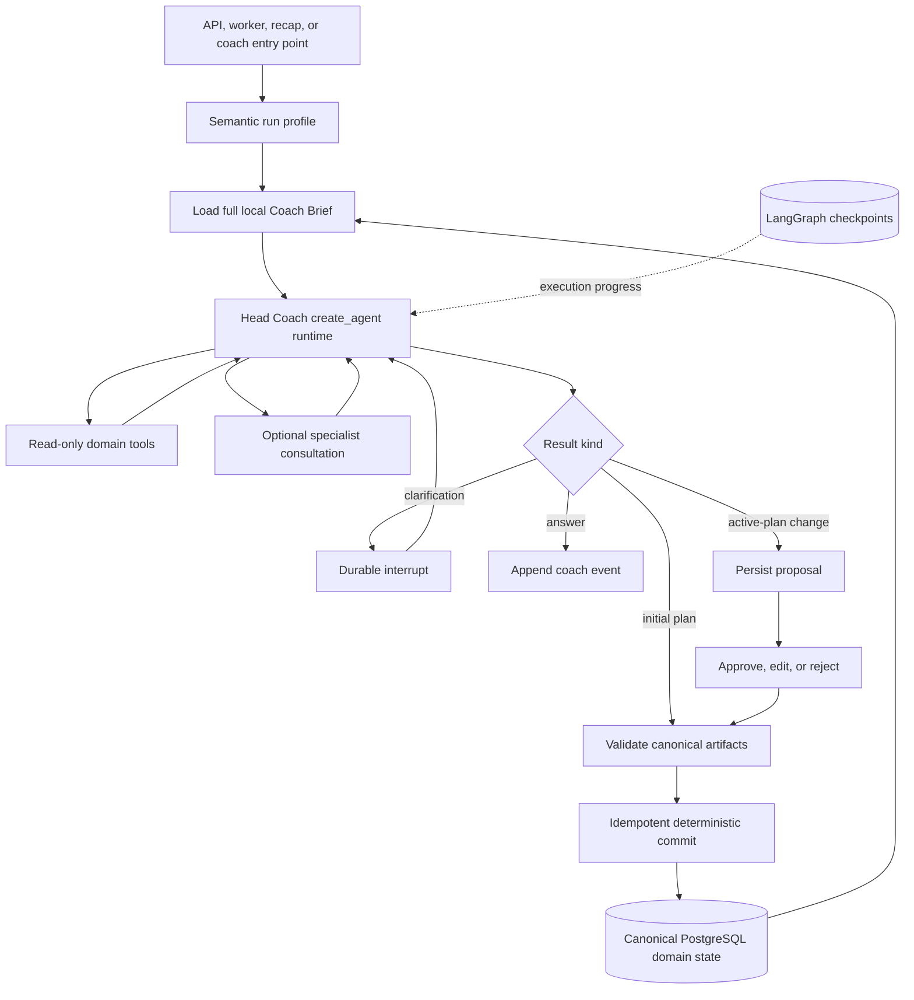
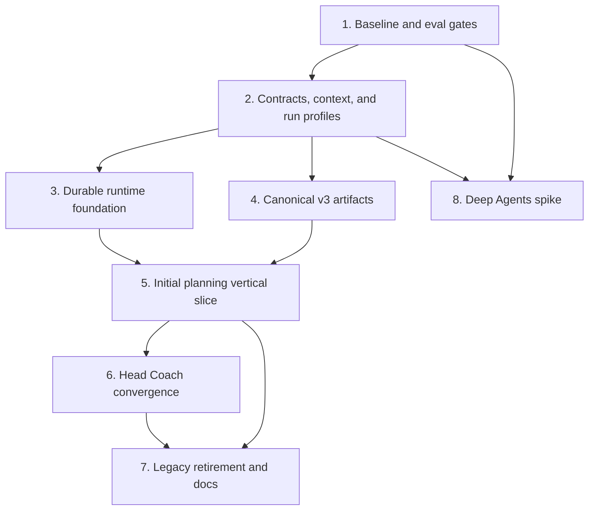
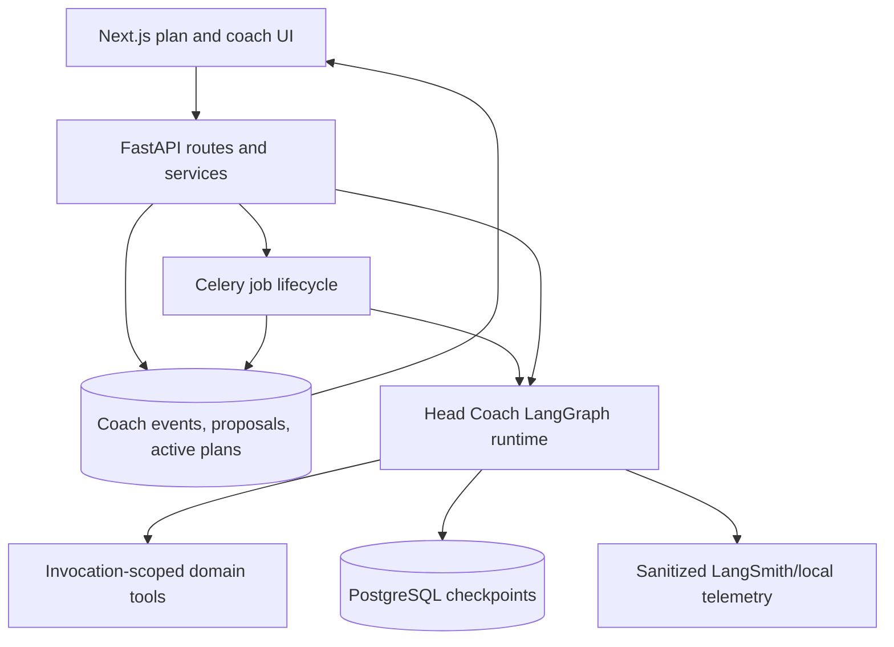

# refactor: Build the persistent Head Coach runtime

## Overview

Replace the provider-shaped mandatory analysis pipeline with one accountable Head Coach built on LangChain's current `create_agent` abstraction and LangGraph's durable runtime. Deliver the change incrementally: first establish evaluation and contracts, then ship a provider-free initial planning path beside the legacy graph, then converge coach chat, recap, daily adaptation, and replanning on the shared runtime. Deep Agents is evaluated separately and does not block the release path.

The first release gate is deliberately narrower than the complete target: provider-free initial plan generation must become resumable, free of mandatory deep-reasoning formatter agents, safe, visually rich, and compatible with existing active-plan APIs and UI. Existing coach conversations, proposals, and schema-v2 plans stay readable throughout migration.

## Problem Frame

The current integrated workflow always runs three provider-oriented summarizers, three provider-oriented experts, synthesis, planners, and three LLM formatters. A real provider-free OpenAI run completed successfully but required 13 model calls, roughly 19 minutes, and at least 227,937 tracked tokens while its provider projections were empty. This contradicts the product's no-wearable-required promise and makes worker failure unnecessarily expensive.

The repo already contains much of the desired ownership infrastructure: local active-plan records, coach threads and events, idempotent turn requests, proposal preview/accept/reject behavior, safety handling, plan version checks, cost records, SSE statuses, and versioned renderers. The plan extends those seams instead of introducing a parallel ownership system (see origin: `docs/brainstorms/2026-07-19-head-coach-agent-architecture-requirements.md`).

## Requirements Trace

- R1-R4: One durable Head Coach identity owns judgment, uses specialists only as consultations, and asks when material context is missing.
- R5-R7: PostgreSQL domain records remain canonical; checkpoint and optional provider state never compete with athlete and plan truth.
- R8-R11: Full coaching context, atomic tools, explicit mutation authority, semantic reasoning profiles, and research tools only when needed.
- R12-R15: Durable checkpoint/resume, interrupts, idempotency, product-level lifecycle events, and backward-compatible migration.
- R16-R17: Validated canonical artifacts carry rich semantic presentation intent; deterministic versioned components render it, with no mandatory target-state deep-reasoning formatter agents.
- R18-R20: Measurable quality gates, a non-blocking Deep Agents spike, and preserved coaching safety.

## Scope Boundaries

- Do not reintroduce a mandatory training-data provider or make a connector part of the release-critical path.
- Do not replace PostgreSQL domain models with LangGraph state, LangGraph Store, OpenAI response state, or virtual files.
- Do not build a general multi-agent platform, arbitrary shell execution, or an agent plugin system.
- Do not require LangGraph Cloud, LangSmith deployment, or any hosted runtime for the local OSS app.
- Do not destructively rewrite existing active plans, jobs, coach events, or memories.
- Do not remove the legacy pipeline until compatibility and evaluation gates pass.
- Do not add Deep Agents to production dependencies during the core migration.
- Do not expose the no-login app beyond loopback or add sensitive athlete context, credentials, or raw model reasoning to logs or public traces.

## Context & Research

### Relevant Code and Patterns

- `services/ai/langgraph/workflows/planning_workflow.py` defines the current mandatory graph and creates a new `MemorySaver` for each invocation.
- `services/ai/langgraph/nodes/tool_calling_helper.py` is the shared hand-rolled loop used by full planning, coach turns, recap, and daily updates.
- `services/ai/coach/continuum_turn_agent.py` already presents a long-term coach identity and returns validated output, but manually binds tools and performs a separate formatting call.
- `api/services/coach_context.py` assembles local memory, plan identity, competitions, events, evidence limits, and UI context.
- `api/services/ongoing_tools.py` demonstrates an invocation-scoped async tool registry, caching, observability, and optional provider degradation.
- `api/services/coach_turn.py` provides idempotent requests, safety disclaimers, proposal creation, version-checked acceptance, event persistence, and trace/cost provenance.
- `api/services/coach_event_store.py` is the existing append-only Decision Ledger foundation and owns ordered thread events.
- `api/models/active_season_plan.py` and `api/models/active_weekly_plan.py` persist versioned JSONB artifacts without requiring a domain-table redesign for a new schema version.
- `worker/tasks.py` owns background job lifecycle, cancellation, progress, result sanitization, and active-plan upserts.
- `api/routers/analysis.py` exposes the existing job start/status/result/cancel contract; `api/routers/coach.py` already streams product statuses over SSE.
- `web/app/src/components/plan-viewer/versioned/plan-renderer.tsx` branches by schema version, and `web/app/src/components/markdown_snippet.tsx` already renders Markdown deterministically.
- `tests/test_coach_turn_idempotency.py`, `tests/test_coach_turn_safety.py`, `tests/test_coach_patch_apply.py`, and `tests/test_langgraph_planning_workflow.py` provide characterization patterns to preserve.

### Institutional Learnings

- No `docs/solutions/` knowledge base exists in this repository, so there are no project-specific solution records to carry forward.
- Root and scoped `AGENTS.md` files are authoritative: agents own coaching judgment; deterministic code owns validation, authorization, persistence, rate limits, and idempotency; async I/O and mocked external services are required.

### External References

- LangChain `create_agent` is the current standard agent abstraction and replaces `langgraph.prebuilt.create_react_agent`: https://docs.langchain.com/oss/python/releases/langchain-v1
- Middleware supports dynamic prompts/tools/models, retries, call limits, summarization, and human-in-the-loop without a custom tool loop: https://docs.langchain.com/oss/python/langchain/middleware/overview
- LangGraph checkpoints enable fault recovery, interrupts, replay, and cross-invocation threads: https://docs.langchain.com/oss/python/langgraph/persistence
- Durable execution requires deterministic replay boundaries and idempotent side effects: https://docs.langchain.com/oss/python/langgraph/durable-execution
- Runtime Context injects user IDs, database dependencies, Store access, and stream writers without serializing them into graph state: https://docs.langchain.com/oss/python/langchain/runtime
- OpenAI Responses supports reasoning profiles and native structured output, but provider-side response state is not used as canonical memory: https://docs.langchain.com/oss/python/integrations/chat/openai
- Deep Agents is an opinionated harness for planning, context files, skills, and subagents; simpler agents should continue to use `create_agent`: https://docs.langchain.com/oss/python/deepagents/overview

## Key Technical Decisions

| Decision | Chosen direction | Rationale |
|---|---|---|
| Agent abstraction | Shared Head Coach factory using LangChain `create_agent` | Removes the custom standard tool loop while retaining LangGraph composition and middleware hooks. |
| Orchestration | Small LangGraph spine around the agent | Deterministic load, review, interrupt, commit, and lifecycle boundaries remain visible and checkpointable; coaching decisions stay with the model. |
| Domain ownership | Existing API services and PostgreSQL records | Coach threads, events, proposals, active plans, jobs, and usage records already enforce core ownership rules. |
| Execution persistence | Persistent PostgreSQL checkpointer with stable job/thread IDs | Resumes completed graph steps across worker restarts; serialized state contains values and IDs only, never sessions or tool objects. |
| Long-term memory | Existing athlete model, memory summary, and event history | Avoids a duplicate LangGraph Store during the first migration. Store adoption requires a later explicit use case. |
| Output contract | Schema-v3 canonical Markdown artifacts, typed calendar/session fields, and semantic presentation blocks | Preserves expressive coaching content and LLM-authored information hierarchy without making raw HTML/CSS part of the model contract. |
| UI composition | Head Coach emits presentation intent by default; a constrained low-cost UI Composer is optional | Rich cards, callouts, tables, checklists, timelines, and disclosures remain plan-specific while separate deep reasoning is avoided. |
| UI migration | Keep v2 renderers; add deterministic v3 React components using existing Markdown support | Existing plans remain readable; React owns accessibility, responsiveness, sanitization, and styling. |
| Invalid model output | Bounded LLM self-repair followed by visible failure | Validation remains deterministic, but rules never invent replacement coaching or presentation content; failed repair commits nothing. |
| Reasoning | Entry-point run profiles with explicit escalation | Initial planning and material replanning get deep reasoning; chat, memory, and rendering do not inherit maximum reasoning accidentally. |
| Specialists | Read-only consultation tools, dynamically exposed | The Head Coach chooses consultation based on the actual task; specialists cannot commit domain changes. |
| Deep Agents | Isolated benchmark spike after core contracts exist | Tests its concrete value without making a fast-moving harness or preview async subagents release-critical. |

## Open Questions

### Resolved During Planning

- **Canonical state boundary:** Existing PostgreSQL domain tables remain canonical. LangGraph checkpointer tables contain execution progress only; no LangGraph Store is introduced in the first migration.
- **Checkpoint identity:** Analysis job ID is the stable thread identity for initial/recalibration jobs. Conversational executions encode coach thread, scope, and run ID in the stable `thread_id`; LangGraph's `checkpoint_ns` remains reserved for its internal subgraph namespace semantics. Invocation-scoped dependencies are re-injected on resume.
- **Checkpoint retention:** Checkpoints may contain private working context required for resume. Runs use distinct execution thread IDs, are removed after a bounded terminal-run retention period, and are included in local-owner deletion. They are never treated as an audit ledger.
- **Artifact boundary:** New outputs use schema-v3 domain artifacts with Markdown narrative, typed calendar fields, and semantic presentation blocks. Existing schema-v2 JSON remains supported and continues through its current proposal operations; schema-v3 proposal parity must land before any v3 plan becomes active.
- **Reasoning routing:** Selection follows explicit run semantics, not message length, provider presence, or deterministic proxy scores. The Head Coach may invoke a bounded deep-consultation capability when a lower-effort entry point encounters a genuinely consequential decision.
- **Initial mutation authority:** A Generate command authorizes one version-checked initial commit. Subsequent material changes continue through proposal acceptance.
- **Release gate:** The core release is not blocked on weekly recap convergence or Deep Agents. It is blocked on the new provider-free initial plan path, safety, compatibility, rich semantic rendering, and durable retry.

### Deferred to Implementation

- Exact schema-v3 field names, Markdown section granularity, and semantic component catalog should be finalized while writing contract tests against representative stored plans.
- Whether native provider structured output or tool-based structured output is more reliable for the complete v3 plan schema must be decided from mocked contract tests and the opt-in real-model evaluation.
- The checkpoint package's table bootstrap must be reconciled with the repo's Alembic policy before execution. This is a persistent schema mutation and requires explicit user approval before implementation touches the database setup.
- Exact prompt composition may be simplified after the baseline eval shows which existing instructions materially affect quality.

## User and Runtime Flows

| Flow | Entry | Important branches | Terminal states |
|---|---|---|---|
| Initial plan | Explicit Generate command | sufficient context; clarification needed; cancellation; model/tool failure | committed; awaiting input; cancelled; failed |
| Resume | Answer to a persisted clarification or worker retry | stale/cancelled job; valid checkpoint; already committed | resumed and committed; conflict; no-op |
| Coach turn | Coach inbox message or plan-day context | answer only; consultation; plan proposal; health concern | message; pending proposal; safe refusal/escalation; error |
| Proposal | Accept, edit, or reject | active-plan version unchanged or stale; duplicate request | committed once; rejected; version conflict; idempotent replay |
| Legacy read | Open existing plan/calendar | schema v2 or v3 | appropriate versioned renderer; explicit unsupported-version error |
| Optional evidence | Future connected-source capability | tool available; unavailable; failing | evidence used with provenance; provider-free continuation |

## High-Level Technical Design

> *This illustrates the intended approach and is directional guidance for review, not implementation specification. The implementing agent should treat it as context, not code to reproduce.*

The dependency structure is:

## Implementation Units

- [x] **Unit 1: Freeze the baseline and add architecture evaluation gates**

**Goal:** Turn the successful provider-free run and existing coach behavior into a repeatable regression baseline before changing orchestration.

**Requirements:** R15, R18, R20

**Dependencies:** None

**Files:**
- Create: `tests/fixtures/head_coach_eval_cases.json`
- Create: `tests/test_head_coach_eval_contracts.py`
- Create: `services/ai/evals/head_coach_eval.py`
- Modify: `tests/test_langgraph_planning_workflow.py`
- Modify: `tests/test_provider_free_release_contract.py`
- Modify: `tests/test_coach_turn_safety.py`
- Modify: `tests/test_cost_tracking_integration.py`

**Approach:**
- Capture representative provider-free cases: sparse beginner context, experienced athlete constraints, conflicting availability, missed week, stale plan, pain/illness, optional evidence unavailable, and material plan change.
- Separate deterministic release gates from opt-in real-model quality experiments. Normal tests mock model and HTTP behavior; real OpenAI evaluation is explicitly invoked and never runs in the default suite.
- Record the current graph trajectory and the July 19 run's calls, latency, tokens, cost, and outputs as baseline metadata without committing private athlete content or generated artifacts.
- Gate hard invariants at 100%: schema validity, declared-constraint preservation, no unauthorized mutation, no provider call in provider-free mode, safety response, and idempotent commit/resume.
- Treat quality as non-inferiority: the new path must have no safety loss and should be rated equal or better in at least 80% of blinded pairwise curated cases before legacy retirement. Require zero dedicated deep-reasoning formatter calls, measure presentation quality explicitly, and target at least 50% fewer mandatory model calls than the 13-call baseline; performance targets cannot justify context stripping, generic UI, or heuristic coaching.

**Execution note:** Add characterization coverage before changing the legacy workflow.

**Patterns to follow:**
- `tests/fixtures/coach_quality_eval_cases.json`
- `services/ai/coach/quality_eval.py`
- `tests/test_coach_quality_eval.py`

**Test scenarios:**
- Happy path: a complete declared-context case produces valid season and execution-plan artifacts and preserves all availability constraints.
- Edge case: no provider observations are present and the expected trajectory contains no provider summarizer, provider expert, or provider tool call.
- Safety: pain or illness input triggers the existing health boundary and never schedules immediate high intensity.
- Mutation: a simulated model result requesting an unauthorized active-plan write is rejected before persistence.
- Evaluation: baseline and candidate outputs can be compared without including athlete PII or requiring a default-suite network call.

**Verification:**
- The suite establishes reproducible behavioral, trajectory, cost, and safety gates against which every later unit can be measured.

- [x] **Unit 2: Define shared Head Coach contracts, context, tools, and reasoning profiles**

**Goal:** Create one reusable Head Coach identity and typed runtime boundary shared by planning and conversational entry points.

**Requirements:** R1-R11, R16, R20

**Dependencies:** Unit 1

**Files:**
- Create: `services/ai/head_coach/__init__.py`
- Create: `services/ai/head_coach/schemas.py`
- Create: `services/ai/head_coach/prompts.py`
- Create: `services/ai/head_coach/run_profiles.py`
- Create: `services/ai/head_coach/runtime_context.py`
- Create: `services/ai/head_coach/tool_policy.py`
- Modify: `services/ai/ai_settings.py`
- Modify: `services/ai/model_config.py`
- Modify: `api/services/coach_context.py`
- Modify: `api/services/ongoing_tools.py`
- Test: `tests/test_head_coach_contracts.py`
- Test: `tests/test_head_coach_tool_policy.py`
- Test: `tests/test_model_config.py`

**Approach:**
- Define a small set of semantic run profiles such as initial planning, material replanning, coach turn, weekly recap, daily adaptation, memory extraction, and specialist consultation.
- Keep per-entry output schemas focused rather than creating one universal mega-response. Share provenance, assumptions, evidence limits, safety, and mutation-intent types.
- Consolidate durable coaching principles from current planner and continuum prompts into one Head Coach identity, while task-specific instructions remain profile-scoped.
- Pass serializable IDs and values in graph state. Inject database/session factories, user identity, capability registry, status writer, and configuration through Runtime Context.
- Convert existing local reads into atomic, typed tools. Dynamically expose optional tools based on actual capabilities and authorization; absence of provider capability results in no provider tool, not an empty analysis stage.
- Use model configuration from `services.ai.model_config`. Deep planning/replanning profiles use high or xhigh effort; coach turns use standard/medium by default; an optional UI Composer uses none/low or at most medium; memory and deterministic rendering do not inherit deep reasoning.

**Patterns to follow:**
- `services/ai/coach/continuum_turn_agent.py` for coaching identity and safety language.
- `api/services/ongoing_tools.py` for async tool construction, request caching, and observability.
- `services/ai/coach/schemas.py` for focused Pydantic contracts.

**Test scenarios:**
- Happy path: initial-planning profile receives complete local context, planning tools, and standard reasoning; xhigh is reserved for bounded material replanning and research.
- Happy path: coach-turn profile receives conversation and active-plan tools but cannot directly commit a plan.
- Edge case: no providers are configured and no provider-named tool is exposed.
- Edge case: a future provider is available but the run profile does not need external evidence, so its tool remains unavailable to the model.
- Safety: specialist and research outputs retain provenance and cannot be promoted to user-declared facts.
- Error path: an invalid or unsupported run profile fails before a model call.

**Verification:**
- All Head Coach entry points can be expressed through typed profiles without hardcoded model names, provider assumptions, or write-capable specialist tools.

- [x] **Unit 3: Add the durable local LangGraph runtime foundation**

**Goal:** Make long-running Head Coach work checkpointable, resumable, observable, and safe under retry.

**Requirements:** R5, R6, R12-R14

**Dependencies:** Unit 2; explicit approval before any checkpoint-table schema mutation

**Files:**
- Modify: `pixi.toml`
- Modify: `pixi.lock`
- Create: `api/migrations/versions/002_add_langgraph_checkpoint_tables.py`
- Create: `services/ai/head_coach/checkpointing.py`
- Create: `services/ai/head_coach/graph.py`
- Create: `services/ai/head_coach/middleware.py`
- Modify: `api/config.py`
- Modify: `.env.example`
- Modify: `worker/celery_app.py`
- Modify: `worker/tasks.py`
- Modify: `api/services/account_deletion.py`
- Test: `tests/test_head_coach_runtime.py`
- Test: `tests/test_head_coach_checkpointing.py`
- Test: `tests/test_head_coach_interrupts.py`
- Test: `tests/test_head_coach_checkpoint_retention.py`

**Approach:**
- Add the official PostgreSQL checkpoint package and one process-safe checkpointer factory; never instantiate a new in-memory saver per production invocation.
- Pin and audit the official checkpointer version, then integrate its required unqualified checkpoint table set through an Alembic migration. The current Python package does not expose a reliable arbitrary PostgreSQL-schema option, so do not depend on a `search_path` trick. Document how future package migrations are reviewed and reflected in Alembic before upgrading.
- Use stable, owner-scoped thread IDs for planning jobs and distinct coach execution threads. Keep LangGraph's root `checkpoint_ns` empty/reserved because the runtime uses it internally for subgraphs. Keep model inputs, messages, artifact drafts, interrupt payloads, and tool results serializable.
- Wrap the shared `create_agent` graph with deterministic load/review/interrupt/commit nodes only where the product lifecycle requires them.
- Use built-in middleware selectively for model/tool call limits, retry policy, dynamic prompts/tools, and lifecycle events. Do not add summarization until a measured context-window need exists, and do not use it to remove required coaching context.
- Ensure side effects occur in idempotent tasks or post-agent commit services. A resumed node must not append duplicate events, consume quota twice, or write the same artifact twice.
- Add a stable PostgreSQL advisory-lock claim derived from run identity so overlapping Celery retry delivery and manual resume cannot execute the same checkpoint concurrently. Release it on pause/termination; cancellation and terminal domain commit always win when a later delivery acquires the lock.
- Define terminal cleanup and local-owner deletion for checkpoint threads. Completed, failed, and cancelled runs remain available only for the bounded debugging window; durable Coach Events and active plans retain the product history.
- Emit stable product lifecycle events independent of graph node names. Trace only sanitized metadata, costs, tool names, and artifact IDs; exclude credentials, raw private context, and raw reasoning.
- Keep an in-memory checkpointer injectable for deterministic tests.

**Patterns to follow:**
- `api/services/coach_turn.py` for idempotency claims and duplicate-safe outcomes.
- `worker/tasks.py` for stable job IDs, cancellation, retry, and progress callbacks.
- `services/ai/langgraph/config/langsmith_config.py` for optional local tracing configuration.

**Test scenarios:**
- Happy path: a graph completes with a stable execution thread ID and records its root checkpoints under LangGraph's reserved root namespace.
- Failure recovery: execution fails after a completed mocked model/tool step, resumes with the same job ID, and does not invoke that completed step again.
- Interrupt: a clarification payload persists, survives graph recreation, accepts one resume value, and continues to the next state.
- Idempotency: duplicate resume and duplicate worker delivery produce one domain commit and one quota/event effect.
- Concurrency: two workers claiming the same run cannot advance the checkpoint concurrently; an expired claim can be recovered.
- Cancellation: a cancelled job cannot be silently resumed by an automatic retry.
- Retention: terminal-run cleanup removes expired checkpoints while leaving canonical plans and Coach Events intact; local-owner deletion removes that owner's checkpoint state.
- Security: checkpoint and trace payloads contain no API keys, database sessions, provider credentials, or raw reasoning blocks.
- Error path: checkpointer unavailability fails the long-running job explicitly without falling back to an unresumable production run.

**Verification:**
- A process restart between completed graph steps can recover the same run, and checkpoint persistence remains clearly separate from domain ownership.

- [x] **Unit 4: Introduce canonical schema-v3 artifacts and rich semantic UI composition**

**Goal:** Preserve rich LLM-authored information hierarchy and coaching components while removing mandatory deep-reasoning formatting passes, raw model-authored HTML, and presentation ownership from React.

**Requirements:** R5, R15-R17

**Dependencies:** Unit 2

**Files:**
- Create: `services/ai/head_coach/artifacts.py`
- Create: `services/ai/head_coach/artifact_rendering.py`
- Create: `services/ai/head_coach/ui_composer.py`
- Modify: `services/ai/langgraph/schemas/ui_blocks.py`
- Modify: `api/services/active_plans.py`
- Modify: `services/ai/coach/schemas.py`
- Modify: `services/ai/coach/patch_apply.py`
- Modify: `api/services/coach_patch_ops.py`
- Modify: `web/app/src/components/plan-viewer/types.ts`
- Create: `web/app/src/components/plan-viewer/versioned/season-plan-view-v3.tsx`
- Create: `web/app/src/components/plan-viewer/versioned/weekly-plan-view-v3.tsx`
- Modify: `web/app/src/components/plan-viewer/versioned/plan-renderer.tsx`
- Create: `web/app/src/lib/demo/fixtures/v3/README.md`
- Test: `tests/test_head_coach_artifacts.py`
- Test: `tests/test_head_coach_ui_composer.py`
- Test: `tests/test_active_plans_v3.py`
- Test: `tests/test_coach_patch_apply.py`
- Test: `tests/test_api_coach_turn_routes.py`
- Test: `web/app/src/tests/plan/schema-v3-rendering.tsx`

**Approach:**
- Define immutable Pydantic value objects for Season Strategy and 28-day Execution Plan with stable IDs, Markdown narrative fields, typed dates/session metadata, semantic presentation blocks, assumptions, risks, evidence provenance, unresolved questions, and a Decision Ledger entry.
- Define a bounded component catalog for plan-specific presentation, including workout, interval table, callout, checklist, fueling, recovery, notes, data table, phase timeline, and disclosure intent. The model chooses hierarchy, grouping, emphasis, tone, and content; React owns the concrete component, CSS, responsive behavior, accessibility, and sanitization.
- Store v3 canonical artifacts in existing JSONB plan payloads; no destructive rewrite of v2 records is required.
- Render Markdown through the existing `MarkdownSnippet` path and map semantic blocks to deterministic React components. Never accept LLM-authored arbitrary HTML or CSS in v3.
- Make direct Head Coach presentation intent the standard path. Evaluate a constrained UI Composer only when it materially improves visual hierarchy: it receives an immutable artifact, may reorganize or annotate presentation blocks, uses none/low or at most medium reasoning, and must preserve a semantic hash of all coaching decisions and typed session data.
- On invalid Head Coach or UI Composer output, return structured validation errors and the rejected output to the responsible model for a bounded repair attempt. Do not synthesize default blocks, silently drop invalid sections, coerce unsupported component types, or replace the result with generic Markdown. If the repair budget is exhausted, fail the run visibly, record sanitized diagnostics, and leave the prior canonical plan untouched.
- Keep v2 renderers unchanged. Branch strictly on `schema_version`, add sanitized synthetic v3 fixtures, and return an explicit unsupported-version state rather than guessing.
- Preserve current calendar identity and proposal requirements: stable day/week IDs, dates, completion state, duration, intensity, and version.
- Extend plan patch validation, preview, and application to dispatch on schema version before any v3 plan can become active. V2 operations remain unchanged; v3 operations target typed session fields and Markdown blocks without introducing arbitrary HTML.

**Execution note:** Start with contract fixtures that both Python validation and the TypeScript renderer consume conceptually; avoid changing v2 behavior while adding v3.

**Patterns to follow:**
- `services/ai/langgraph/schemas/ui_blocks.py` for versioned validated data.
- `web/app/src/components/plan-viewer/versioned/plan-renderer.tsx` for schema dispatch.
- `web/app/src/components/markdown_snippet.tsx` for safe deterministic Markdown rendering.

**Test scenarios:**
- Happy path: representative v3 season and weekly artifacts validate and render all narrative and calendar fields.
- Compatibility: a stored v2 plan renders through the unchanged v2 path after v3 is introduced.
- Edge case: Markdown contains links, tables, lists, and line breaks and renders without executable HTML or scripts.
- Composition: the Head Coach can select different semantic components for different plan content instead of producing a uniform Markdown wall.
- Composer safety: an attempt to change a workout prescription, date, duration, intensity, assumption, or risk returns precise validation feedback for LLM repair; exhausted repair fails without a commit.
- Repair: malformed component intent is corrected by the responsible mocked model after receiving field-level errors and then validates successfully.
- Repair exhaustion: repeated invalid output produces an explicit failed result, preserves the previous active plan, and generates no rule-authored replacement blocks.
- Edge case: unknown schema version yields an explicit safe unsupported state.
- Validation: duplicate IDs, out-of-range dates, or execution days outside the declared block fail before persistence.
- Mutation: completion state and plan version survive deterministic re-rendering and round trips.
- Proposal parity: a v3 day change previews, rejects stale versions, applies once after acceptance, and leaves the v2 proposal path unchanged.

**Verification:**
- New artifact fixtures render as rich plan-specific components without a dedicated deep-reasoning formatter, while existing v2 fixtures and calendar tests continue to pass.
- Completed 2026-07-19: immutable v3 Season Strategy and exact 28-day Execution artifacts, semantic-hash-preserving optional composition, bounded responsible-model repair, strict kind-specific schema dispatch, typed v3 mutations/proposals, and rich React renderers shipped with sanitized synthetic fixtures. Full verification passed: Ruff, Mypy (271 source files), Pytest (538 passed, 3 skipped), frontend fixtures/tests/type-check/lint, version governance, and Next.js production build.

- [x] **Unit 5: Ship the provider-free initial planning vertical slice**

**Goal:** Route initial Generate requests through the durable Head Coach, commit schema-v3 artifacts once, and preserve current job/API behavior.

**Requirements:** R1-R18, R20

**Dependencies:** Units 3 and 4

**Files:**
- Create: `services/ai/head_coach/initial_planning.py`
- Create: `web/app/src/components/plan-viewer/plan-generation-interrupt.tsx`
- Modify: `worker/tasks.py`
- Modify: `api/routers/analysis.py`
- Modify: `api/services/status_messages.py`
- Modify: `api/services/full_run_policy.py`
- Modify: `web/app/src/app/actions/plan.ts`
- Modify: `web/app/src/app/app/plan/page.tsx`
- Test: `tests/test_head_coach_initial_planning.py`
- Test: `tests/test_worker_head_coach_plan.py`
- Test: `tests/test_api_head_coach_resume.py`
- Test: `tests/test_worker_analysis_results.py`
- Test: `web/app/src/tests/onboarding/no-provider-first-run.ts`
- Test: `web/app/src/tests/plan/plan-generation-interrupt.tsx`

**Approach:**
- Add an explicit workflow-version selector to the job config so new initial drafts use the Head Coach path while existing jobs and rollback can still invoke legacy behavior during the migration window.
- Assemble the full local Coach Brief from profile, competitions, declared history, constraints, current date/calendar, prior plans when relevant, and existing memory. Do not construct empty metrics/physiology/activity projections.
- Let the agent produce v3 Season Strategy and Execution Plan through validated structured output. A deterministic review node checks schema, constraints, safety, and commit authority; it does not replace coaching judgment with score thresholds.
- Use the existing job ID as checkpoint thread ID and idempotency key. Commit both active artifacts and the Decision Ledger record in one deterministic transaction or leave the prior active state unchanged.
- Acquire the AnalysisJob row and the per-user generation guard before commit. The application transaction writes season plan, weekly plan, Decision Ledger event, usage/cost linkage, and terminal job result together. Checkpoint completion is outside that transaction and may be retried; a retry observes the terminal job/source identity and returns the already-committed result instead of writing again.
- Add `awaiting_input` as a job lifecycle state for durable clarifications and a resume operation that supplies the answer to the existing checkpoint. Cancellation remains terminal.
- Treat `awaiting_input` as a successful pause, not a Celery failure: persist a sanitized interrupt envelope in the job projection, release the worker and execution lease, and enqueue the same job ID only after an authorized resume request.
- On the plan page, replace progress with one inline Coach question card containing the question, a text response, Continue, and Cancel. Refreshing the page reconstructs the same card from job status; Continue is keyboard/submission accessible, disables while submitting, and uses an idempotency key so double submission cannot enqueue two resumes. Resume authorization reuses job ownership checks.
- Translate runtime events to product copy such as understanding context, designing strategy, building the block, reviewing constraints, awaiting input, and saving the plan.
- Keep result serialization compatible for current clients during rollout; new clients branch on artifact schema version.

**Execution note:** Build the new path beside the legacy workflow and keep the switch reversible until the evaluation gate passes.

**Patterns to follow:**
- `worker/tasks.py` job lifecycle and `_upsert_active_results` transaction boundaries.
- `api/routers/analysis.py` start/status/result/cancel ownership checks.
- `api/services/coach_turn.py` idempotency and proposal conflict behavior.

**Test scenarios:**
- Happy path: a provider-free Generate request reaches the Head Coach path, emits product statuses, and commits one v3 season and weekly plan.
- Edge case: sparse but sufficient declared context produces explicit assumptions without fabricating device metrics.
- Clarification: materially insufficient availability causes `awaiting_input`; a valid answer resumes the same job and commits once.
- Clarification UI: refresh preserves the pending question, empty answers stay local with an actionable validation state, double submit enqueues once, and Cancel reaches the terminal cancelled state.
- Failure recovery: a worker crash after strategy completion resumes without repeating the completed call.
- Cancellation: cancelling before resume leaves current active plans unchanged and prevents retry resurrection.
- Concurrency: two Generate requests for the same owner cannot interleave into a mixed season/weekly active state.
- Commit recovery: a crash after the domain transaction but before checkpoint finalization returns the already-committed artifacts on retry and emits no duplicate Decision Ledger event.
- Compatibility: a legacy in-flight job still finishes through the legacy path and remains readable.
- Safety: injury/illness context cannot result in an unsafe immediate-intensity plan and is surfaced in assumptions/risks.
- Performance: provider-free trajectory has zero mandatory provider-specialist and zero dedicated deep-reasoning formatter calls, while any optional UI Composer is separately attributed and the total path meets the agreed call-reduction gate.

**Verification:**
- The local first-run journey works end to end through the new path, survives a forced restart, and can be rolled back without data loss.

**Completed 2026-07-19:** New initial drafts now route through the durable Head Coach selector, pause and resume through an owned `awaiting_input` job state, and atomically publish schema-v3 Season Strategy and 28-day Execution artifacts with Decision Ledger, usage, and cost linkage. The source-of-ownership generation path was split into Strategy and Execution stages after live OpenAI gates showed the monolithic xhigh and medium calls exceeding ten minutes. GPT-5.6 Sol in standard (`medium`) reasoning produced a fully validated two-stage artifact pair in 233 seconds. PostgreSQL integration tests cover restart-safe checkpoints, exclusive claims, atomic publication, and duplicate-commit suppression; frontend tests cover the durable clarification card.

- [x] **Unit 6: Converge coach chat, proposals, recap, and daily adaptation on the Head Coach**

**Goal:** Present one coherent coach identity and runtime across ongoing interactions without weakening existing proposal, safety, quota, or event behavior.

**Requirements:** R1-R14, R16, R20

**Dependencies:** Unit 5

**Files:**
- Modify: `services/ai/coach/continuum_turn_agent.py`
- Modify: `services/ai/recap/weekly_recap_agent.py`
- Modify: `services/ai/daily/daily_update_agent.py`
- Modify: `services/ai/coach/plan_modifier_agent.py`
- Modify: `api/services/coach_turn.py`
- Modify: `api/services/recap.py`
- Modify: `api/services/daily_update_runs.py`
- Modify: `api/routers/coach.py`
- Modify: `api/routers/weekly_recap.py`
- Test: `tests/test_continuum_turn_agent.py`
- Test: `tests/test_api_coach_turn_routes.py`
- Test: `tests/test_coach_turn_idempotency.py`
- Test: `tests/test_coach_turn_safety.py`
- Test: `tests/test_weekly_recap_agent.py`
- Test: `tests/test_daily_update_agent.py`
- Test: `web/app/src/tests/coach/coach-turn-sse.ts`

**Approach:**
- Migrate one entry point at a time to the shared factory, beginning with coach chat because it already has strong ownership and contract tests, then recap and daily adaptation.
- Preserve the existing API service as the mutation boundary: the model returns an answer or proposal intent; deterministic code validates patch operations, previews the versioned plan, and commits only after acceptance.
- Replace custom tool-loop traces with standard agent/tool events mapped onto the existing coach event projection and cost provenance.
- Build provider-free recap from plan execution, completion state, athlete responses, calendar history, and conversation context. Optional provider evidence remains an additive future capability.
- Use durable interrupts for clarification or sensitive mutation approval where the existing proposal flow is not sufficient; do not force a second approval layer onto already-versioned proposal acceptance.

**Patterns to follow:**
- Existing `CoachProposal`, plan patch operations, thread event ordering, and request idempotency.
- Existing SSE `status`, `result`, `error`, and `done` envelope.

**Test scenarios:**
- Chat answer: a context question produces one coach message and no proposal or plan mutation.
- Proposal: a material change produces a preview, waits for acceptance, and commits against the expected plan version.
- Conflict: the active plan changes before acceptance and the proposal is rejected with the existing version conflict.
- Duplicate request: replaying the same idempotency key returns the prior response without another model call, quota charge, or event.
- Provider-free recap: completed/missed calendar sessions and athlete feedback produce a useful recap without activity-provider data.
- Safety: pain/illness and pharmaceutical requests preserve current disclaimer/refusal behavior.
- Streaming: standard agent events map to stable product status messages without exposing internal node names or reasoning.

**Verification:**
- Ongoing surfaces share the Head Coach prompt/runtime and retain all existing proposal, quota, provenance, event, and safety contracts.

**Completed 2026-07-19:** Coach chat, weekly recap, and daily adaptation now use the shared `create_agent` Head Coach factory with explicit semantic run profiles, bounded structured-output repair, provider-free local tools, and optional connected evidence. Recap and daily narratives emit schema-v3 semantic blocks, while v1/v3 proposal preview and acceptance remain deterministic service-owned boundaries. The coach UI renders semantic recap content and schema-v3 before/after proposal diffs without model-authored HTML. Full verification passed: Ruff, Mypy (278 source files), Pytest (552 passed, 4 skipped), frontend tests/type-check/lint, and the Next.js production build.

- [x] **Unit 7: Retire the mandatory legacy graph and align architecture documentation**

**Goal:** Remove superseded provider-shaped stages and mandatory deep-reasoning formatter agents only after the new rich semantic path passes release gates.

**Requirements:** R7, R15, R17, R18, R20

**Dependencies:** Units 5 and 6; evaluation gate passed

**Files:**
- Modify or remove superseded modules under: `services/ai/langgraph/workflows/`
- Modify or remove superseded modules under: `services/ai/langgraph/nodes/`
- Modify: `services/ai/langgraph/utils/workflow_cost_tracker.py`
- Modify: `api/services/status_messages.py`
- Modify: `agents_docs/architecture/ai_ui_contract.md`
- Modify: `agents_docs/roadmap/now.md`
- Modify: `agents_docs/roadmap/roadmap.md`
- Modify: `agents_docs/roadmap/decision_log.md`
- Modify: `services/ai/.agents/skills/langgraph-workflows/SKILL.md`
- Modify: `README.md`
- Modify: `CHANGELOG.md`
- Test: `tests/test_no_legacy_agent_path.py`
- Modify: `tests/test_status_messages.py`
- Modify: `tests/test_provider_free_release_contract.py`

**Approach:**
- Delete only nodes and helpers with no remaining runtime consumer. Keep compatibility schemas/renderers needed to read historical v2 artifacts.
- Remove metrics/physiology/activity mandatory fan-out, master-orchestrator loops, and dedicated deep-reasoning analysis/season/weekly formatter calls from the default path. Retain the semantic component catalog, optional constrained UI Composer, and deterministic React rendering.
- Update the local LangGraph skill to recommend `langchain.agents.create_agent` rather than the deprecated prebuilt ReAct helper and to document the new source-of-truth boundaries.
- Record the durable decision: one Head Coach, database-owned artifacts, checkpoint-owned execution progress, on-demand specialists, and evidence-gated Deep Agents.
- Preserve cost/latency observability using semantic run profiles and tool events instead of legacy node-name accounting.

**Execution note:** Run a reference search before every deletion. The repository owner explicitly declined a backward-compatible generation switch before this unit, so all new and repeat generation now use the Head Coach; historical artifact renderers remain versioned and readable.

**Patterns to follow:**
- Versioned UI renderers remain additive; old stored artifacts are never rewritten merely to remove runtime code.
- Root release audit and secret/PII constraints remain mandatory.

**Test scenarios:**
- Default path: no production entry point executes mandatory provider summarizers, experts, or dedicated deep-reasoning formatter nodes; rich semantic component rendering remains covered.
- Compatibility: schema-v2 stored plans still render and can be read after legacy runtime deletion.
- Observability: cost, token, latency, lifecycle, and tool metrics remain attributed to semantic Head Coach profiles.
- Security: release audit finds no private eval data, checkpoints, traces, or generated personal artifacts tracked in git.

**Verification:**
- The repo documentation and runtime describe the same architecture, all release gates pass, and no dead legacy path remains accidentally callable.

**Completed 2026-07-19:** Every Generate and refresh run now routes to the durable Head Coach; the worker has no legacy fallback. The provider-shaped summarizer/expert/orchestrator graph, manual tool loop, dedicated formatter agents, orphaned signal digest, unsafe plotting stack, node-name cost tracker, legacy seeding CLI, and obsolete model roles were removed after reference checks. Memory extraction moved to the shared low-reasoning profile. Product progress now exposes one semantic lifecycle, and the primary plan/job pages dispatch schema-v3 artifacts through the real versioned renderer. Architecture, roadmap, decision log, contributor skill, README, and changelog now describe the same ownership model. Verification passed: Ruff, Mypy (224 source files), Pytest (442 passed, 4 skipped), frontend tests/type-check/lint, Next.js production build, version governance, and `git diff --check`.

- [ ] **Unit 8: Evaluate Deep Agents for one bounded research specialist**

**Goal:** Determine whether Deep Agents measurably improves a real long-horizon specialist task without changing the production Head Coach architecture prematurely.

**Requirements:** R3, R11, R18, R19

**Dependencies:** Units 1 and 2; does not block Units 3-7

**Files:**
- Create: `experiments/deep_agents_event_research/README.md`
- Create: `experiments/deep_agents_event_research/evaluate.py`
- Create: `tests/fixtures/event_research_eval_cases.json`
- Test: `tests/test_deep_agents_spike_contract.py`

**Approach:**
- Compare a simple `create_agent` research specialist with a Deep Agents version on event rules/course research that benefits from planning, context isolation, citations, and multi-step synthesis.
- Use synthetic/public cases only. Give both variants the same model, source access, output schema, and budget.
- Evaluate correctness, source quality, tool trajectory, latency, cost, context isolation, cancellation needs, and integration effort.
- Keep the experiment outside production imports and lockfiles unless the spike is explicitly run. Do not evaluate preview async subagents as a release dependency.
- Promote Deep Agents only through a later explicit architecture decision if it produces a meaningful quality or operability advantage that cannot be obtained from selected LangChain middleware.

**Patterns to follow:**
- `tests/fixtures/head_coach_eval_cases.json` for comparable cases and sanitized evaluation data.
- Head Coach specialist output contracts from Unit 2.

**Test scenarios:**
- Contract: both variants return the same validated, citation-bearing specialist recommendation schema.
- Isolation: the specialist cannot mutate athlete, calendar, plan, or Decision Ledger state.
- Failure: unavailable web/source tooling returns a bounded failure recommendation rather than invented event facts.
- Evaluation: the experiment reports comparable call, token, latency, cost, and quality results without affecting default tests.

**Verification:**
- The experiment ends with an evidence-backed adopt/defer/reject recommendation and creates no production coupling by default.

## System-Wide Impact

- **Interaction graph:** Initial Generate continues through API job creation and Celery; coach chat continues through the API service and SSE. Both call the shared Head Coach runtime while API/worker services retain transaction ownership.
- **Error propagation:** Model/tool failures become explicit job or turn failures; durable interruptions become `awaiting_input`; provider/tool unavailability is evidence metadata unless the requested capability is genuinely required; commit conflicts remain HTTP/job conflicts rather than silent overwrite.
- **State lifecycle risks:** Stable checkpoint IDs, idempotency claims, versioned active plans, transactional commits, terminal cancellation, and serialized-state rules prevent partial or duplicate state. Checkpoints never authorize mutation by themselves.
- **API surface parity:** Analysis start/status/result/cancel remains compatible; a resume operation and `awaiting_input` state are additive. Coach SSE envelopes remain stable. v2 and v3 artifacts coexist behind `schema_version`.
- **Integration coverage:** Tests must cross API → worker → checkpoint → model mock → artifact validation → active-plan persistence → API read → versioned frontend rendering. Unit-only mocks cannot establish resume or commit-once behavior.
- **Unchanged invariants:** One local owner, loopback-only no-login runtime, optional tracing, no provider requirement, no default real API calls in tests, plan version conflicts, existing quota enforcement, and current safety boundaries remain unchanged.

## Success Metrics

- 100% of deterministic safety, schema, provider-free, authorization, idempotency, and resume gates pass.
- New provider-free initial planning performs zero mandatory provider-specialist and zero dedicated deep-reasoning formatter calls; any optional UI Composer is low-cost, separately measured, and cannot alter coaching semantics.
- Mandatory model calls are reduced by at least 50% from the 13-call baseline without reducing supplied coaching context.
- Blinded curated-case evaluation rates the candidate equal or better than the legacy output in at least 80% of cases, with no safety regression.
- A forced worker restart after a completed expensive step resumes without repeating that step and commits one artifact set.
- All existing v2 fixtures remain readable; all new v3 fixtures render deterministically.
- Deep Agents adoption remains an explicit measured decision, not an implicit dependency.

## Phased Delivery

### Phase A — Characterize and establish foundations

- Units 1-4 establish evaluation, ownership contracts, durable runtime, and v3 artifacts without switching production defaults.

### Phase B — Release-critical vertical slice

- Unit 5 switches new initial provider-free plans behind a reversible workflow-version selector.
- Release only after quality, safety, compatibility, resume, and public-repo audits pass.

### Phase C — Converge the ongoing coaching loop

- Unit 6 moves coach chat, proposals, recap, and daily adaptation to the shared runtime one surface at a time.

### Phase D — Simplify and decide optional harness adoption

- Unit 7 removes proven-dead legacy orchestration and aligns docs.
- Unit 8 independently evaluates Deep Agents and may finish before or after the core migration without blocking it.

## Alternative Approaches Considered

- **Adopt Deep Agents as the product runtime immediately:** Rejected for the core path because its filesystem/task/subagent defaults exceed current needs, async subagents remain fast-moving, and our canonical state is relational domain data rather than an agent workspace.
- **Keep the fixed graph and merely skip empty provider nodes:** Useful as a short-lived hotfix but does not establish one accountable coach, durable resume, shared tools, or separation between coaching semantics and UI composition.
- **Replace LangGraph entirely with direct OpenAI Responses state:** Rejected because provider-side state conflicts with local-first ownership, durable replay, provider portability, and local observability.
- **Build a custom agent framework:** Rejected because current LangChain middleware and LangGraph runtime already cover the standard tool loop, persistence, interrupts, and streaming.
- **Big-bang rewrite of all AI surfaces:** Rejected because it creates unnecessary release and data risk; existing coach and proposal infrastructure provides safe incremental seams.

## Risks & Dependencies

| Risk | Likelihood | Impact | Mitigation |
|---|---|---|---|
| PostgreSQL checkpoint bootstrap conflicts with the single-baseline migration policy | Medium | High | Require explicit approval, document ownership of checkpoint tables, test fresh install and upgrade, and avoid touching canonical user data. |
| Large structured plan output is unreliable with the selected OpenAI mode | Medium | High | Keep schemas decomposed, compare native/tool strategies in opt-in evals, validate before commit, and preserve a reversible legacy path. |
| New v3 artifact shape breaks calendar/proposal behavior | Medium | High | Add versioned renderers and fixtures first; preserve v2; require stable IDs and typed session fields; migrate proposal parity before retiring v2 mutation code. |
| Checkpoint replay duplicates quota, events, or active plans | Medium | High | Keep side effects out of replayable model nodes, reuse idempotency patterns, use transactional version checks, and test forced retries. |
| Shared prompt becomes a new monolith | Medium | Medium | Keep one identity/core principles but task-specific run profiles and focused response schemas; measure prompt behavior through evals. |
| Dynamic tools hide required context | Low | High | Full Coach Brief is always supplied; dynamic exposure controls capabilities, not evidence pre-filtering; missing tools are observable. |
| Architecture work delays the OSS release indefinitely | Medium | High | Treat Unit 5 as the release-critical slice; defer convergence, legacy deletion, and Deep Agents until after its gates pass. |
| LangSmith leaks athlete context | Low | High | Sanitize trace metadata, keep tracing optional, exclude raw context/reasoning, and add security assertions/release audit. |

## Documentation / Operational Notes

- Update `agents_docs/roadmap/now.md` when Unit 1 begins so the architecture migration is visible beside the v2.2 release gate.
- Record the Head Coach ownership decision in `agents_docs/roadmap/decision_log.md` when the release-critical slice is accepted.
- Replace the stale `create_react_agent` recommendation in `services/ai/.agents/skills/langgraph-workflows/SKILL.md` during Unit 7.
- Document checkpoint setup, cleanup, backup expectations, and local troubleshooting without placing secrets in tracked files.
- Keep real-model evaluation opt-in and clearly report model, reasoning profile, latency, calls, tokens, cost, and trace correlation.

## Sources & References

- **Origin document:** [docs/brainstorms/2026-07-19-head-coach-agent-architecture-requirements.md](../brainstorms/2026-07-19-head-coach-agent-architecture-requirements.md)
- Related architecture: `agents_docs/architecture/ai_ui_contract.md`
- Related roadmap: `agents_docs/roadmap/roadmap.md`
- Current planning workflow: `services/ai/langgraph/workflows/planning_workflow.py`
- Current coach runtime: `services/ai/coach/continuum_turn_agent.py`
- Current ownership services: `api/services/coach_turn.py`, `api/services/coach_event_store.py`, `api/services/active_plans.py`
- LangChain v1: https://docs.langchain.com/oss/python/releases/langchain-v1
- LangChain agents and middleware: https://docs.langchain.com/oss/python/langchain/agents
- LangGraph persistence and interrupts: https://docs.langchain.com/oss/python/langgraph/persistence
- Deep Agents overview: https://docs.langchain.com/oss/python/deepagents/overview
