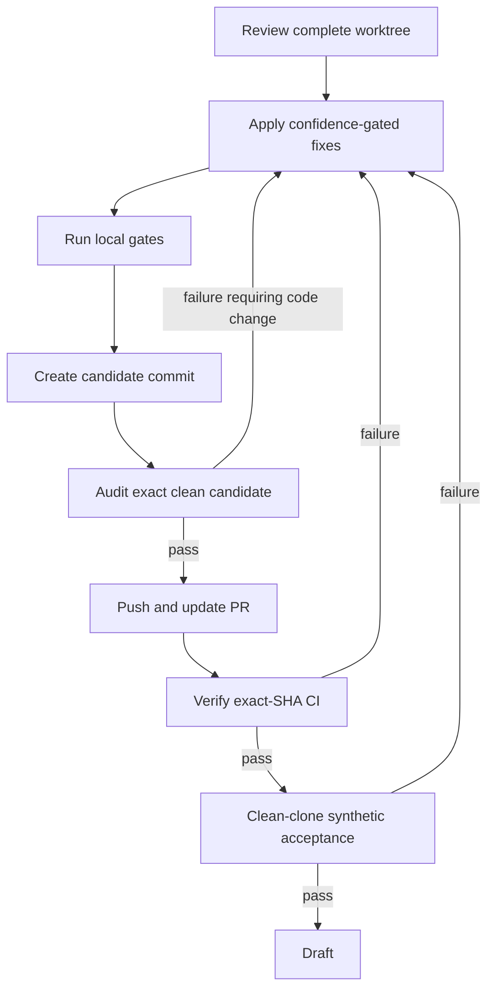
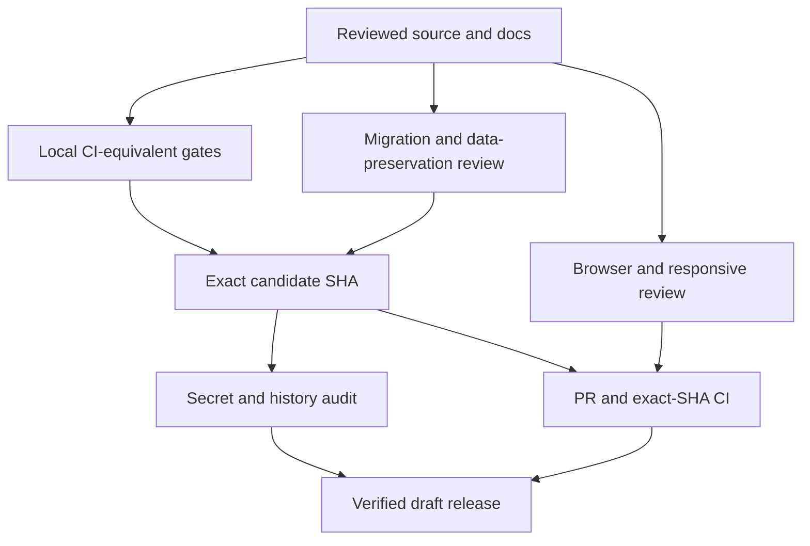

# fix: Certify the v2.2.0 release candidate

## Overview

Turn the current wearable- and training-data-provider-free Head Coach and schema-v3 worktree into a reviewed, reproducible v2.2.0 release candidate. OpenAI API access remains required for AI generation. The work covers confidence-gated code review, high-confidence fixes, exact-candidate verification and secret scanning, a clean commit and pull request, exact-SHA CI, browser acceptance, PR demo evidence, and a verified GitHub draft release. Publication remains a separate maintainer decision and is not authorized by this plan.

## Problem Frame

The product now completes the local-first athlete journey through profile, competitions, a provider-free OpenAI planning run, schema-v3 season and execution artifacts, the compact calendar, dashboard, and plan-aware coaching. The implementation is locally green, but the release evidence predates the Head Coach migration and the current worktree contains a large cross-layer change. The previous clean-install and secret-scan results therefore cannot certify this candidate (see origin: `docs/brainstorms/2026-07-13-athlete-first-oss-release-requirements.md`; architecture origin: `docs/brainstorms/2026-07-19-head-coach-agent-architecture-requirements.md`).

## Requirements Trace

### Candidate review and invariants

- R1. Review the complete candidate for correctness, security, data integrity, contract drift, reliability, maintainability, and release-policy compliance; apply only confidence-gated fixes.
- R2. Preserve the provider-free, local-first ownership contract, loopback boundary, full coaching context, fail-fast model repair, and rich schema-v3 UI.
- R3. Preserve existing athlete data: do not inspect, reset, migrate, or delete the maintainer database, secrets, traces, or generated personal artifacts.

### Candidate identity and verification

- R4. Produce a fixed candidate commit whose full SHA is the identity for local verification, secret/history scans, remote branch state, CI, browser evidence, and draft release. SHA-bound evidence lives in the PR, draft release, and ignored local evidence—not inside the commit it certifies.
- R5. Run the full backend, frontend, version-governance, migration, and release-audit gates against the exact candidate; any post-candidate fix invalidates and repeats the evidence.
- R6. Repeat the synthetic clean-install provider-free journey in an isolated Compose namespace, including restart persistence and plan-aware coach chat, without retaining model output or private evidence.

### Remote delivery and draft preparation

- R7. Push the candidate, create or update its PR, require CI results whose `headSha` equals the candidate SHA, and autonomously fix/repeat until green.
- R8. Create a reviewed GitHub draft release for `v2.2.0`, explicitly verify its draft state and exact target, and do not publish it.

### Publication boundary

- R9. Leave external legal review and immutable publication as explicit remaining gates requiring the maintainer's final Go.

## Scope Boundaries

- Do not publish the GitHub release, merge to `main`, rewrite Git history, rotate credentials, or change repository visibility.
- Do not touch the maintainer's local athlete database or ignored `.env`, trace, log, data, backup, or generated-artifact contents.
- Do not reintroduce Strava, WHOOP, Garmin, daily sync, weekly recap, hosted auth, payments, or a public-network deployment path.
- Do not implement the optional Deep Agents experiment; it remains non-blocking future work.
- Do not manufacture deterministic coaching fallbacks when model repair is exhausted.

## Context & Research

### Relevant Code and Patterns

- `services/ai/head_coach/` owns the shared Head Coach runtime; `services/ai/head_coach/graph.py` keeps deterministic load/review/commit boundaries around model judgment.
- `services/ai/head_coach/checkpointing.py`, `worker/tasks.py`, and `api/services/active_plans.py` are the critical durability and commit-once seam.
- `config/version_manifest.yaml`, `core/version_manifest.py`, and `web/app/src/lib/generated/version-manifest.ts` define release, database, and UI schema governance.
- `web/app/src/components/plan-viewer/versioned/` and `web/app/src/lib/demo/fixtures/` define strict versioned rendering; dashboard projection must not force schema-v3 artifacts through legacy HTML blocks.
- `.github/workflows/ci.yml` is the exact-commit automated gate and uses Node.js 24.
- `scripts/release_audit.sh` scans an isolated candidate export and reachable Git history and refuses a dirty tree.
- `docs/releases/v2.2.0-verification.md` is the evidence format to update without prompts, model outputs, traces, private logs, databases, or athlete data.

### Institutional Learnings

- `docs/solutions/best-practices/head-coach-release-hardening-2026-08-01.md` captures the verified lifecycle and release-hardening invariants from this review. Root/scoped `AGENTS.md`, `agents_docs/architecture/ai_ui_contract.md`, `agents_docs/ops/version_governance.md`, and `docs/local-first/data-preservation.md` remain authoritative contracts.
- Prior release evidence is useful only as a test design; it must be repeated because it certifies an older commit and legacy planning architecture.
- Checkpoint state is disposable execution state, never canonical domain truth. Retry/resume must not duplicate plan commits, usage, cost, or Decision Ledger events.

### External References

- Gitleaks v8.30.1 current commands and redaction: https://github.com/gitleaks/gitleaks/blob/v8.30.1/README.md#commands
- Gitleaks v8.30.1 release and checksums: https://github.com/gitleaks/gitleaks/releases/tag/v8.30.1
- GitHub exact required-check behavior: https://docs.github.com/en/pull-requests/how-tos/merge-and-close-pull-requests/troubleshooting-required-status-checks
- GitHub draft release management: https://docs.github.com/en/repositories/releasing-projects-on-github/managing-releases-in-a-repository
- GitHub secure workflow and evidence guidance: https://docs.github.com/en/actions/reference/security/secure-use

## Key Technical Decisions

| Decision | Direction | Rationale |
|---|---|---|
| Candidate identity | One full Git commit SHA | A branch name or latest run can move and cannot bind audit, CI, and release evidence together. |
| Secret scanner | Verified direct Gitleaks v8.30.1 binary when Docker credential resolution is broken | Avoid modifying the user's Docker credential configuration; verify the official checksum before execution. |
| Scan coverage | Current candidate tree plus `git --all --full-history` | Both present content and reachable history are public-release surfaces. |
| Review fixes | Confidence-gated, source-backed autofix | A large late-stage refactor should not absorb speculative cleanup. |
| Clean install | Disposable Compose project and synthetic athlete only | Proves public setup without risking maintainer data or retaining personal evidence. |
| CI acceptance | PR head OID and every accepted run must equal candidate SHA | Prevents accepting a stale green branch run. |
| Draft release | Explicit draft creation and post-create assertion | GitHub release creation defaults can publish unless draft state is explicit. |

## Open Questions

### Resolved During Planning

- Audit ordering: create a provisional fixed candidate commit, audit that clean exact commit, and create a new candidate plus repeat all evidence if any fix follows.
- Existing `v2.2.0` version: retain it because version governance is already aligned and no public immutable `v2.2.0` tag is assumed; preflight the remote tag before draft creation and abort on a conflicting target.
- Docker scanner failure: use the official direct Gitleaks binary with verified SHA-256 rather than altering global Docker configuration.
- Legal review: record it as an outstanding publication gate; a draft release is allowed, publication is not.
- Exact-SHA evidence: keep final SHA, audit, CI, E2E, and draft-state evidence in ignored local metadata plus the PR/draft release; tracked documentation is finalized before the candidate commit and contains no self-referential SHA claim.
- Acceptance ports: use the documented loopback ports in an exclusive test window. Gracefully stop the maintainer stack without deleting its volumes, inventory it first, run the isolated namespace, then restore the original stack.
- OpenAI credential: use only an already exported runtime credential without opening or copying ignored secret files. Inject it at runtime into the minimum required services, disable optional tracing, retain no request/response content, and fail closed if no authorized runtime credential is available.
- GitHub credentials: use the existing authenticated repository identity with only branch/PR/draft-release permissions; verify the repository before every mutation and never print auth values or invoke merge, force-push, publish, tag-retarget, visibility, or administrative operations.
- Public terminology: “provider-free” always means wearable- and training-data-provider-free; README, onboarding, PR, and release notes state plainly that an OpenAI API key is required for AI generation.
- Clarification acceptance: cover the clarification UI deterministically with a synthetic contract state even if the real OpenAI run does not choose to interrupt.

### Deferred to Implementation

- PR number and current review state: discover after the candidate branch is pushed.
- CI failures: diagnose from exact-run logs and fix only concrete failures, then mint a new candidate SHA and repeat affected evidence.
- Whether the synthetic OpenAI run requests clarification: exercise either durable continuation path and record only non-sensitive outcomes.

## High-Level Release Flow

> *This illustrates the intended approach and is directional guidance for review, not implementation specification. The implementing agent should treat it as context, not code to reproduce.*

## Implementation Units

- [x] **Unit 1: Review the complete candidate**

**Goal:** Establish whether the worktree satisfies product, architecture, safety, persistence, API/UI contract, and release requirements.

**Requirements:** R1-R3

**Dependencies:** None

**Files:**
- Review: all changed and untracked source, migration, configuration, documentation, and test files
- Test evidence: `tests/`, `web/app/src/tests/`

**Approach:**
- Before expensive work, fetch the remote tag namespace read-only and verify that immutable tag `v2.2.0` does not already target a conflicting commit. Stop for a version decision if it does; repeat the check immediately before draft creation to cover races.
- Review the diff by risk surface: secrets/privacy, migration/data integrity, Head Coach correctness and durability, API contracts, worker reliability, schema-v3 UI, provider-free cleanup, documentation, and release operations.
- Check deleted legacy modules for live imports and public contract loss.
- Deduplicate findings and keep only issues supported by concrete code paths or failing gates.
- Maintain an ignored review-coverage ledger mapping every changed, new, generated, and deleted path to a named risk surface and `reviewed/no-finding/finding` status, with explicit entries for migrations, workflows, generated contracts, and removed legacy modules.

**Test scenarios:**
- Contract: every new schema-v3 producer has a strict parser, renderer, fixture, mutation path where applicable, and explicit unknown-version failure.
- Durability: retry/resume/cancellation cannot duplicate a plan, event, quota, or cost record.
- Security: no key, raw reasoning, athlete context, trace, database, or generated personal artifact is tracked or logged into release evidence.
- Compatibility: supported historical artifact versions remain readable without guessing their schema.
- Release identity: a pre-existing conflicting immutable `v2.2.0` tag halts work before certification effort begins.

**Verification:**
- Every changed/deleted path is accounted for in the ignored coverage ledger, and every finding has severity, confidence, evidence, and an explicit fix or reason for rejection.

- [x] **Unit 2: Apply high-confidence release fixes**

**Goal:** Correct validated findings without broadening product scope or weakening agent autonomy.

**Requirements:** R1-R3, R5

**Dependencies:** Unit 1

**Files:**
- Modify: only files implicated by accepted findings
- Test: corresponding Python or TypeScript contract tests
- Modify: release, migration, and operational documentation when it contradicts the actual candidate

**Approach:**
- Add or strengthen regression coverage before risky behavior changes.
- Preserve fail-fast structured-output repair, deterministic infrastructure boundaries, loopback-only runtime, and existing local data.
- Remove stale release checkmarks/evidence claims that do not apply to the new candidate.

**Test scenarios:**
- Happy path: provider-free planning, dashboard, calendar, and plan-aware coach surfaces retain the successful behavior already exercised.
- Failure path: invalid model output, unavailable checkpoints, stale proposal versions, and backend failures remain explicit and preserve canonical state.
- Documentation: public commands, Node/Python requirements, Alembic head, removed providers, and supported schemas agree with executable configuration.

**Verification:**
- Accepted findings are fixed with focused regression evidence; no speculative cleanup remains in the candidate.

- [x] **Unit 3: Establish full local preflight acceptance**

**Goal:** Prove code quality, buildability, and migration/version consistency before freezing the SHA.

**Requirements:** R2-R6

**Dependencies:** Unit 2

**Files:**
- Test: `tests/test_head_coach_postgres_integration.py` or a focused Alembic upgrade test beside it
- Verify: `.github/workflows/ci.yml`, `config/version_manifest.yaml`, `api/migrations/versions/`, `docker-compose.yml`

**Approach:**
- Run the complete CI-equivalent suite using the documented Node.js 24 and Pixi environments.
- Run the full lint, type, test, build, version, migration-contract, and static release-contract gates without reading or mutating maintainer data.
- Treat this as preflight only. Exact-candidate clean-install and real-model evidence begins after a committed SHA exists.

**Test scenarios:**
- Automated happy path: backend and frontend suites, Node.js 24 production build, and version governance pass together.
- Migration contract: a fresh synthetic database can upgrade through the declared Alembic head without touching the maintainer database.
- Existing-data upgrade: a disposable database at revision `001_initial_local_first` containing a synthetic owner and historical active-plan rows upgrades to `002_head_coach_checkpoints` while preserving row identity and readability.
- Static release contract: loopback bindings, provider-free public paths, and forbidden artifact checks remain enforced.

**Verification:**
- All deterministic local gates pass and the worktree is ready to be frozen into a candidate commit.

- [ ] **Unit 4: Freeze and audit the exact candidate**

**Goal:** Create one clean candidate commit and certify its present content and reachable history.

**Requirements:** R3-R5

**Dependencies:** Unit 3

**Files:**
- Test: `tests/test_release_audit_contract.py`
- Modify: `scripts/release_audit.sh`
- Verify: `.gitleaks.toml`, `scripts/release_audit.sh`, `.gitignore`

**Approach:**
- Commit the intentionally reviewed scope, confirm a clean worktree, and capture the full SHA and tree identity.
- Fetch published remote branch and tag refs without force-pushing, rewriting, or deleting history. Ensure the audit copies and scans remote-tracking refs in addition to local heads and tags, and record the scanned ref set so remote-only published ancestry is not omitted.
- Obtain the official Gitleaks v8.30.1 Linux binary and checksum manifest in temporary ignored storage, verify its SHA-256, and run both candidate-directory and all-reachable-history scans with full redaction.
- Do not commit or upload scanner reports. If code or documentation changes after the candidate commit, create a new candidate and repeat all SHA-bound evidence.

**Test scenarios:**
- Candidate scan: tracked candidate content produces zero findings and a failing scanner exit cannot be mistaken for a pass.
- History scan: all branches/tags reachable through `--all --full-history` produce zero findings.
- Remote-only history: published remote branch ancestry is included even when it has no local branch counterpart.
- Failure path: checksum mismatch, unavailable scanner, dirty tree, or report parse failure blocks progress.

**Verification:**
- Clean exact SHA has passing fully redacted directory/history audits and non-sensitive evidence outside the certified commit.

- [ ] **Unit 5: Push the candidate and drive exact-SHA CI to green**

**Goal:** Put the audited candidate under remote review and accept only CI for that exact object.

**Requirements:** R4, R5, R7

**Dependencies:** Unit 4

**Files:**
- Modify if needed: `.github/workflows/ci.yml` and files implicated by concrete CI failures
- Update: pull request title/body/checklist and release-evidence links

**Approach:**
- Push the branch, create or update its PR, and record the remote PR head OID.
- Compare `.github/workflows/ci.yml` with the trusted `main` baseline and the Definition-of-Done commands in root/scoped `AGENTS.md`. Reject candidate-controlled CI that removes, weakens, conditionally skips, or makes non-blocking any expected Node 24 install, frontend lint/type/test/build, version-governance, Ruff, MyPy, or full-test gate.
- Wait for required checks; compare PR `headRefOid` and every accepted workflow `headSha` with the candidate SHA.
- Diagnose concrete failures from logs. Every fix produces a new candidate and repeats local gates, audit, push, and exact-SHA comparison.
- Retry an unchanged external/flaky failure at most twice after root-cause classification. Do not mutate code for an unreproduced platform, permission, quota, or download failure; after two unchanged retries, record the external condition as a blocker instead of looping indefinitely.

**Test scenarios:**
- Happy path: required CI passes and all accepted runs target the exact candidate SHA.
- Stale run: a green run for an earlier branch commit is rejected as evidence.
- Weakened workflow: exact-SHA CI is rejected if a required baseline gate was removed, skipped, or made non-blocking in the candidate workflow.
- Failure path: dependency install, Node 24, version governance, lint, type, test, or build failure is reproduced and fixed before retry.

**Verification:**
- PR is reviewable and all required checks are green for its exact head SHA.

- [ ] **Unit 6: Complete exact-candidate clean-install and browser evidence**

**Goal:** Verify the exact remote candidate from a clean checkout, exercise the real provider-free product, and attach concise visual evidence to the PR without exposing private data.

**Requirements:** R2, R3, R6-R7

**Dependencies:** Unit 5

**Files:**
- Modify if a defect is found: affected `web/app/` code and tests
- Update: pull request description with sanitized demo evidence

**Approach:**
- Clone the remote exact candidate SHA into a separate path and follow only the public setup documentation with a unique random Compose project, new named volumes, synthetic local owner, and before/after resource inventory. Reserve the documented loopback ports by gracefully stopping—but never deleting—the existing maintainer stack, then restore it after acceptance. Never reuse the current `.env`, Compose project, `LOCAL_OWNER_USER_ID`, database, or volume.
- With only an already exported supported OpenAI runtime credential, save a synthetic profile and A-race; generate persisted schema-v3 season and 28-day execution artifacts; exercise clarification/repair if invoked; ask a plan-specific coach question; restart normally and confirm persistence and commit-once behavior. Do not open or copy ignored secret files, enable LangSmith, persist the credential in an image/config file, or retain request/response content.
- Evaluate the generated result with a human product rubric recorded only as pass/fail: season and execution strategy agree, declared availability and constraints are honored, sessions are actionable without wearable data, material uncertainty is explicit, injury context is handled conservatively, and the coach answer accurately references the active plan.
- Exercise dashboard, 28-day calendar, selected-day details, season strategy, clarification card, and coach chat at desktop and mobile widths using only that synthetic namespace.
- Confirm compact calendar hierarchy, progressive disclosure of rich LLM content, visible failure states, keyboard access, and no hydration/console errors at representative 1440×900 desktop and 390×844 mobile viewports. At 200% zoom there is no page-level horizontal overflow; interactive controls expose accessible names and visible focus, disclosures expose expanded/collapsed semantics, and primary touch targets are at least 44×44 CSS pixels.
- Exercise the clarification branch deterministically through a sanitized synthetic job state: enter awaiting-input, submit or cancel, show recoverable failure, resume once, and reach a visible terminal state. The real-model run exercises the same path only when the Head Coach requests it naturally.
- Record a short sanitized feature walkthrough for the PR; do not include keys, traces, private athlete data, or model prompts.

**Test scenarios:**
- Desktop/mobile: calendar remains primary and rich rationale is available on demand without overflowing the viewport.
- Real-model terminal state: profile and A-race are saved, season/execution schema-v3 artifacts are active, the coach response is plan-specific, no provider/device claim is invented, and restart preserves state without duplicate active plans.
- Interaction states: initial loading, profile-without-plan, generation in progress, coach response in progress, clarification awaiting input, and recoverable backend failure each explain the state, preserve known data, expose the next valid action, and transition cleanly.
- Clarification: synthetic coverage guarantees the submit, cancel, resume, duplicate-submit, and error branches even when the real model does not interrupt.
- Error state: an unreachable API shows an honest preserved-data message rather than fabricated onboarding state.
- Safety: rendered semantic blocks cannot execute model-authored HTML or scripts.
- Cleanup: on success or failure, preserve only explicitly sanitized status metadata in ignored temporary storage, then remove the exact disposable namespace and synthetic volumes before the release workflow completes. Never export environment values, prompts, model output, traces, request bodies, or response bodies.

**Verification:**
- Exact-candidate clean install and browser checks pass, non-sensitive evidence is bound to the SHA, and a sanitized feature video is linked from the PR.

- [ ] **Unit 7: Create and verify the GitHub draft release**

**Goal:** Prepare the complete v2.2.0 release artifact for maintainer review without publishing it.

**Requirements:** R4, R8-R9

**Dependencies:** Units 5 and 6

**Files:**
- Verify: committed `CHANGELOG.md`, `docs/local-first/release-checklist.md`, and `docs/releases/v2.2.0-verification.md`
- Update remotely: draft release notes and SHA-bound evidence only

**Approach:**
- Repeat the early preflight for tag `v2.2.0`. If it now exists, require it to resolve to the exact candidate SHA; otherwise abort rather than retargeting it.
- Create the release explicitly as a draft targeted at the candidate SHA, then fetch it and assert tag, target, URL, and `isDraft=true`.
- Release notes are finalized before the candidate commit, then copied into the remote draft without modifying the certified tree. They lead with the complete athlete outcome and no-wearable-required boundary, state that OpenAI API access is required for AI generation, then explain local-first ownership, Head Coach architecture, known limitations, setup, AI/medical/privacy caveats, and the wearable-/training-data-provider-free scope.
- Leave legal review and publication unchecked and request the maintainer's final Go only after external legal review is complete.

**Test scenarios:**
- Happy path: draft exists, is not published, targets the exact candidate, and contains reviewed notes.
- Conflict: an existing mismatched tag blocks draft creation.
- Safety: no `.env`, secret report, database, raw trace, private screenshot, prompt, or model output is attached.

**Verification:**
- Reviewed remote release remains a draft on the exact green candidate SHA; no immutable release was published.

## System-Wide Impact

- **Interaction graph:** Source contracts flow through API, worker, LangGraph checkpoints, PostgreSQL artifacts, versioned React rendering, local acceptance, GitHub CI, and the draft release.
- **Error propagation:** Any source change after candidate creation invalidates downstream evidence and returns execution to local verification and audit.
- **State lifecycle risks:** Maintainer data is outside scope; only disposable synthetic stacks may be created and destroyed. Remote draft state is created but never published.
- **API surface parity:** Existing supported plan schemas and coach/API envelopes remain explicit; unknown versions fail visibly.
- **Integration coverage:** Automated tests are necessary but not sufficient; exact-candidate migration, restart, OpenAI, browser, and remote-CI evidence close the cross-layer gaps.
- **Unchanged invariants:** Local owner, loopback binding, explicit LLM key, provider-free coaching, optional tracing, transactional domain ownership, and final maintainer publication authority remain unchanged.

## Risks & Dependencies

| Risk | Likelihood | Impact | Mitigation |
|---|---|---|---|
| Large deletion hides a live legacy dependency | Medium | High | Reference search, import/startup tests, contract review, and exact CI before accepting deletion. |
| Retry commits artifacts twice | Low | High | Review domain transaction identity and dedicated restart/duplicate-delivery tests. |
| Migration damages local data | Low | High | Never exercise it on maintainer data; test fresh/upgrade paths only in disposable databases. |
| Acceptance credential leaks | Low | Critical | Use only an already exported runtime credential, inject it into minimum required services, disable tracing, retain no content/log bundle, and fail closed if unavailable. |
| Secret scanner appears green without running | Medium | High | Verify official binary checksum and scanner exit; record version and status, not sensitive report content. |
| CI passes a stale branch commit | Medium | High | Compare PR OID and workflow `headSha` to the full candidate SHA. |
| Browser/video captures private state | Medium | High | Use sanitized synthetic fixtures or disposable synthetic data and inspect every frame before attaching. |
| Draft release is accidentally published | Low | Critical | Create explicitly as draft and immediately assert remote `isDraft=true`; never invoke publish. |
| Legal review remains outstanding | High | High | Keep publication blocked and checklist factual; draft preparation does not waive the gate. |

## Documentation / Operational Notes

- Update stale statements that fresh installs stop at migration `001`; the manifest now identifies `002_head_coach_checkpoints` as Alembic head.
- Before freezing the candidate, reset stale checklist claims and finalize `CHANGELOG.md`, verification methodology, and release-note source without embedding a future self-referential SHA.
- Distinguish historical V1 artifact compatibility from planning documents that use “V2” as a product-release label.
- Record candidate SHA, clean-tree assertion, tool versions, UTC timestamps, command outcomes, CI URLs and matching head SHAs, dependency lock hashes, and draft URL/state. Never record secret values or private athlete/model content.
- The release checklist must describe current evidence rather than retain checkmarks from the pre-Head-Coach candidate.

## Sources & References

- **Origin document:** [docs/brainstorms/2026-07-13-athlete-first-oss-release-requirements.md](../brainstorms/2026-07-13-athlete-first-oss-release-requirements.md)
- Architecture origin: `docs/brainstorms/2026-07-19-head-coach-agent-architecture-requirements.md`
- Architecture plan: `docs/plans/2026-07-19-001-refactor-head-coach-runtime-plan.md`
- Release checklist: `docs/local-first/release-checklist.md`
- Prior verification record: `docs/releases/v2.2.0-verification.md`
- GitHub workflow: `.github/workflows/ci.yml`
- Release audit: `scripts/release_audit.sh`
